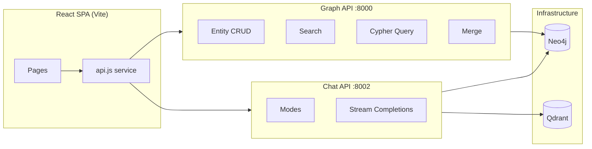
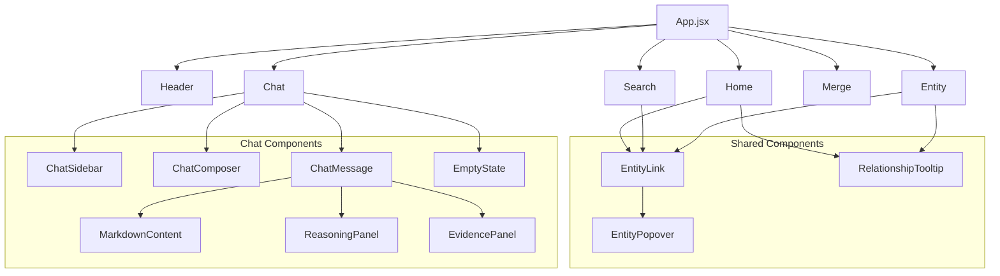
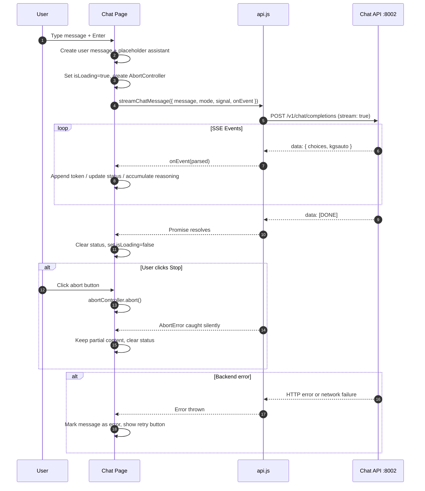

# KGsAuto Frontend

React SPA for browsing, searching, merging, and chatting with a Vietnamese knowledge graph built from UET markdown sources.

## Overview



## Tech Stack

| Layer | Technology |
|-------|-----------|
| Framework | React 19 |
| Bundler | Vite 8 |
| Routing | React Router DOM 7 |
| Markdown | react-markdown + remark-gfm |
| Graph viz | react-force-graph-2d |
| Styling | Plain CSS with custom properties |
| Linting | ESLint 9 |

## File Structure

```
src/
├── main.jsx                    # Entry point
├── App.jsx                     # Router + global layout
├── index.css                   # Global styles + design tokens
├── services/
│   └── api.js                  # All backend API calls
├── components/
│   ├── Header.jsx              # App header + nav + search
│   ├── EntityLink.jsx          # Link with hover popover
│   ├── EntityPopover.jsx       # Portal-based entity preview
│   └── RelationshipTooltip.jsx # Relationship description tooltip
└── pages/
    ├── Home.jsx                # Random triplets explorer
    ├── Search.jsx              # Lexical/hybrid entity search
    ├── Entity.jsx              # Entity detail + duplicates
    ├── Merge.jsx               # Cypher console + merge tools
    └── chat/
        ├── index.jsx           # Chat orchestrator (state + streaming)
        ├── ChatSidebar.jsx     # Mode/TopK/starters/reset
        ├── ChatComposer.jsx    # Textarea + send/abort
        ├── ChatMessage.jsx     # Message bubble + actions
        ├── MarkdownContent.jsx # ReactMarkdown wrapper
        ├── ReasoningPanel.jsx  # Collapsible reasoning trace
        ├── EvidencePanel.jsx   # Evidence cards
        ├── EmptyState.jsx      # Landing screen
        ├── Icons.jsx           # Inline SVG icons
        └── chat.css            # Chat-scoped styles
```

## Routing

| Path | Page | Description |
|------|------|-------------|
| `/` | Home | Random knowledge graph triplets |
| `/search` | Search | Entity search (empty state) |
| `/search/:query` | Search | Entity search with query |
| `/chat` | Chat | RAG chatbot interface |
| `/entity/:id` | Entity | Entity detail view |
| `/merge` | Merge | Cypher console + merge tools |

## Component Hierarchy



## Chat Streaming Flow



## API Service Reference

### Graph API (`GRAPH_API_BASE` — default `http://localhost:8000`)

| Method | Endpoint | Used by |
|--------|----------|---------|
| `getRandomTriplets(limit)` | `GET /api/random_triplets` | Home |
| `search(query)` | `GET /api/search` | — |
| `searchLexical(query, topK, labelFilter)` | `GET /api/search/lexical` | Search, Entity |
| `searchHybrid(query, topK, labelFilter)` | `GET /api/search/hybrid` | Search |
| `getEntity(id)` | `GET /api/entity/:id` | Entity, EntityPopover |
| `mergeEntities({ canonical_id, merge_ids })` | `POST /api/entity/merge` | Merge |
| `runCypher(cypher)` | `POST /api/query` | Merge |
| `getGraphMetadata()` | `GET /api/graph/metadata` | Search |

### Chat API (`CHAT_API_BASE` — default `http://localhost:8002`)

| Method | Endpoint | Used by |
|--------|----------|---------|
| `getChatModes()` | `GET /modes` | Chat |
| `sendChatMessage(...)` | `POST /query` | (available, not used by UI) |
| `streamChatMessage(...)` | `POST /v1/chat/completions` | Chat |

## Styling

### Design Tokens (`:root` in `index.css`)

```css
--primary: #336699;
--text: #333;
--bg: #fff;
--border: #e0e0e0;
```

### Chat-scoped Tokens (`.chat-shell` in `chat.css`)

```css
--chat-text: #1f2937;
--chat-text-muted: #667085;
--chat-text-soft: #475467;
--chat-surface: #ffffff;
--chat-surface-soft: #f9fafb;
--chat-surface-tint: #f8fbff;
--chat-border: var(--border);
--chat-border-strong: #d0d5dd;
--chat-user-bg: #eff6ff;
--chat-user-border: #bfdbfe;
--chat-danger: #b42318;
--chat-danger-bg: #fffbfa;
--chat-danger-border: #fda29b;
--chat-radius-sm: 10px;
--chat-radius-md: 12px;
--chat-radius-lg: 16px;
--chat-shadow-card: 0 8px 30px rgba(15, 23, 42, 0.06);
```

### Conventions

- Global styles use semantic class names (`.entity-title`, `.merge-button`)
- Chat uses `chat-` prefix for all selectors — fully isolated from other pages
- No Tailwind, no CSS modules, no CSS-in-JS
- Responsive breakpoint at `860px` (single-column collapse)

## Environment Variables

| Variable | Purpose | Default |
|----------|---------|---------|
| `VITE_GRAPH_API_BASE_URL` | Graph/admin API base | `http://localhost:8000` |
| `VITE_API_BASE_URL` | Backward-compatible alias | `http://localhost:8000` |
| `VITE_CHAT_API_BASE_URL` | Chat API base | `http://localhost:8002` |

## Development

```bash
# Install dependencies
npm install

# Start dev server
npm run dev

# Production build
npm run build

# Lint
npm run lint

# Preview production build
npm run preview
```

### Prerequisites

- Node.js 18+
- Graph API running on `:8000` (for Home, Search, Entity, Merge)
- Chat API running on `:8002` (for Chat page)
- Neo4j populated with graph data
- Qdrant with indexed markdown chunks (for semantic/hybrid chat modes)

## Key Design Patterns

| Pattern | Where | Purpose |
|---------|-------|---------|
| Manual SSE streaming | `api.js` → Chat | Token-by-token UI updates |
| AbortController | Chat, Search | User-cancelable requests + timeouts |
| Optimistic placeholder | Chat | Insert assistant bubble before stream starts |
| Incremental metadata | Chat | Accumulate reasoning steps during stream |
| On-demand hover fetch | EntityPopover | Load entity data only when popover opens |
| Portal overlays | EntityPopover | Escape stacking context issues |
| Route-driven state | Search, Entity | URL params drive data fetching |
| Local persistence | Merge | Last Cypher query saved to localStorage |
