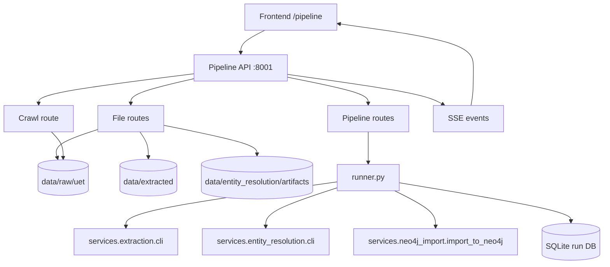
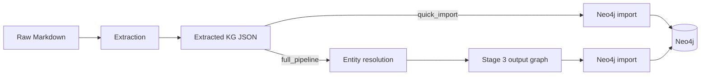
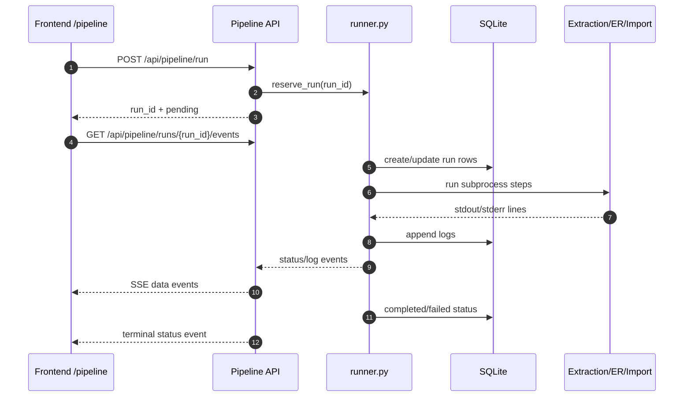

# KGsAuto Pipeline API

`apps/pipeline_api` orchestrates the document-to-graph workflow used by the frontend `/pipeline/*` pages. It manages raw Markdown files, optional crawling, pipeline run history, cancellation, and live run events.

## Overview



## Run locally

Run from the repository root after starting the local infrastructure with `docker compose up -d`.

```bash
uvicorn apps.pipeline_api.main:app --host 0.0.0.0 --port 8001 --reload
```

Useful URLs:

- API docs: http://localhost:8001/docs
- Health: http://localhost:8001/api/health

## Routes

### Health

| Method | Endpoint | Description |
|--------|----------|-------------|
| `GET` | `/api/health` | Service health check |

### Files

| Method | Endpoint | Description |
|--------|----------|-------------|
| `GET` | `/api/files/raw` | List raw Markdown files and whether each has extracted KG output |
| `GET` | `/api/files/extracted` | List extracted `*_kg.json` files with node/relationship counts when readable |
| `GET` | `/api/files/resolved` | List entity-resolution artifact runs and stage availability |
| `POST` | `/api/files/upload` | Upload one or more raw Markdown files |
| `DELETE` | `/api/files/raw/{filename}` | Delete a raw Markdown file by safe filename |

### Crawl

| Method | Endpoint | Description |
|--------|----------|-------------|
| `POST` | `/api/crawl` | Crawl URLs into the raw Markdown directory |

### Pipeline runs

| Method | Endpoint | Description |
|--------|----------|-------------|
| `POST` | `/api/pipeline/run` | Start a pipeline run |
| `GET` | `/api/pipeline/runs` | List recent runs |
| `GET` | `/api/pipeline/runs/{run_id}` | Get run detail and recent logs |
| `POST` | `/api/pipeline/runs/{run_id}/cancel` | Cancel the active run |
| `GET` | `/api/pipeline/runs/{run_id}/events` | Stream status/log events as `text/event-stream` |

## Run modes

`POST /api/pipeline/run` accepts `mode` as either `quick_import` or `full_pipeline`.



- `quick_import`: runs `services.extraction.cli`, then imports `data/extracted` directly into Neo4j.
- `full_pipeline`: runs extraction, runs `services.entity_resolution.cli --stage all --store-backend qdrant`, then imports `data/entity_resolution/artifacts/{run_id}/stage3/output_graph` into Neo4j.

Only one active run is reserved at a time. A second trigger returns a conflict until the current run completes, fails, or is cancelled.

## Event stream

The frontend subscribes with `EventSource` to `/api/pipeline/runs/{run_id}/events`.



Event payloads are JSON encoded in `data:` lines. Idle streams emit `{"type": "ping"}` keepalive events.
