# Services Architecture

## Overview

`services/` contains the backend data pipeline and runtime retrieval layer for KGsAuto. It turns crawled web pages into Markdown, extracts knowledge graph JSON with LLMs, resolves duplicate entities, imports the graph into Neo4j, and serves multiple RAG modes over Neo4j and Qdrant.

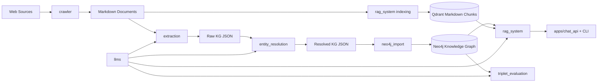

## Service Responsibilities

| Service | Responsibility | Main entry points |
|---|---|---|
| `crawler` | Crawls source websites and converts pages into cleaned Markdown. | `services/crawler/main.py`, `crawl_lib.py` |
| `extraction` | Extracts nodes and relationships from Markdown into KG JSON using an LLM. | `services/extraction/cli.py`, `extract.py` |
| `entity_resolution` | Deduplicates extracted graph entities and rewrites graph JSON to canonical IDs. | `services/entity_resolution/cli.py`, `pipeline.py` |
| `neo4j_import` | Imports resolved KG JSON into Neo4j. | `services/neo4j_import/import_to_neo4j.py` |
| `rag_system` | Runs semantic, graph, hybrid, naive, and direct RAG modes over Qdrant/Neo4j. | `services/rag_system/cli.py`, `pipeline.py` |
| `triplet_evaluation` | Samples Neo4j relationships and judges KG quality with evidence plus LLM. | `services/triplet_evaluation/cli.py`, `evaluator.py` |
| `llms` | Shared LLM provider abstraction used by extraction, RAG, ER, and evaluation. | `services/llms/factory.py`, `base.py` |
| `config.py` | Shared environment-driven settings for databases, embeddings, LLMs, RAG, and evaluation. | `services/config.py` |

## End-to-End Data Flow

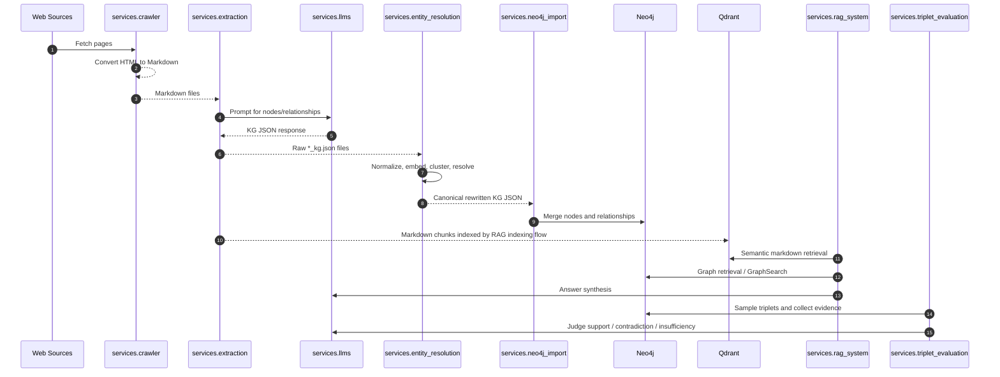

## Key Concepts

### Markdown is the shared source artifact

The crawler produces Markdown, and that Markdown feeds two downstream paths:

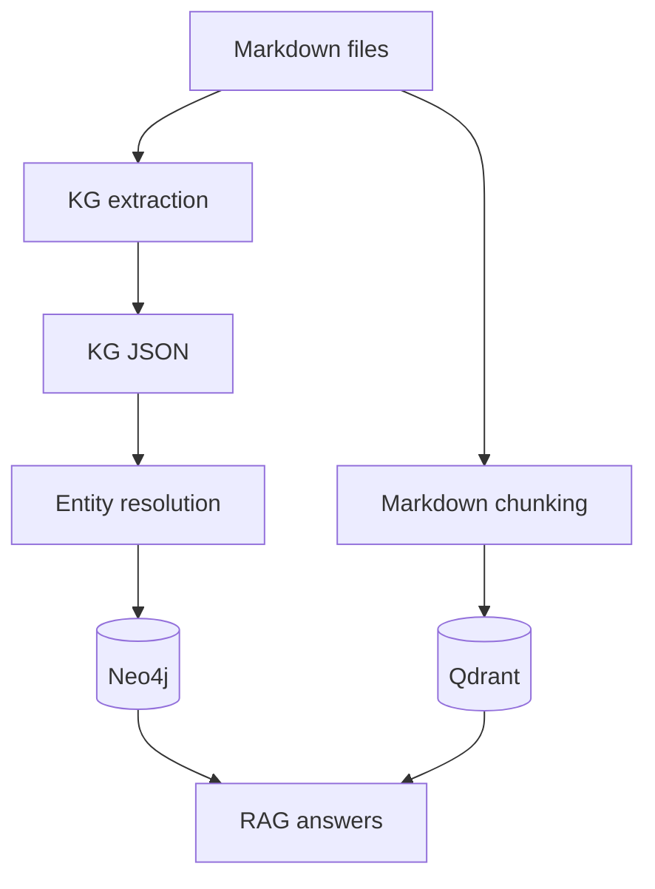

This split lets the system answer from both textual evidence and graph-structured evidence.

### KG construction is staged

The graph build path is intentionally separated into extraction, resolution, and import.

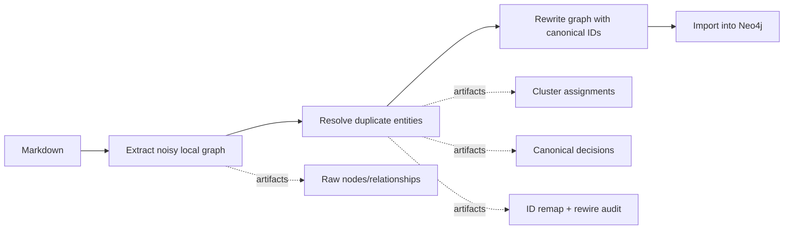

This makes it easier to inspect quality problems at each boundary instead of debugging only the final Neo4j graph.

### Runtime RAG has multiple modes behind one pipeline

`services/rag_system/pipeline.py` exposes one query surface, while mode modules choose the retrieval strategy.

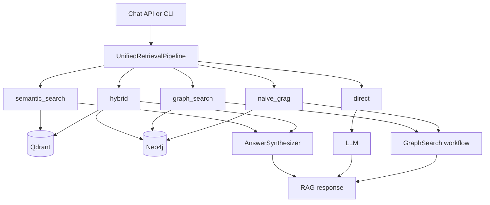

## Service Details

### `services/crawler`

The crawler is the ingestion edge. It fetches pages, extracts useful content from HTML, converts structures such as tables, lists, and headings into Markdown, and writes cleaned `.md` files for downstream processing.

Primary files:

- `services/crawler/main.py`
- `services/crawler/crawl_lib.py`
- `services/crawler/crawlv2.py`
- `services/crawler/test_conversion.py`

### `services/extraction`

The extraction service converts Markdown documents into structured KG JSON.

It:

1. Reads Markdown input files.
2. Groups related files into clusters.
3. Builds extraction prompts with optional context.
4. Calls an LLM through `services.llms.get_llm`.
5. Parses and validates JSON.
6. Writes one `*_kg.json` file per source document.
7. Records metrics, logs, and failed raw responses.

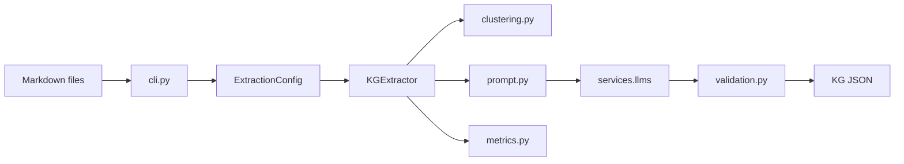

Primary files:

- `services/extraction/cli.py`
- `services/extraction/extract.py`
- `services/extraction/config.py`
- `services/extraction/prompt.py`
- `services/extraction/validation.py`
- `services/extraction/clustering.py`
- `services/extraction/cluster_state.py`

### `services/entity_resolution`

Entity resolution deduplicates noisy extracted entities before graph import. It is split into three stages:

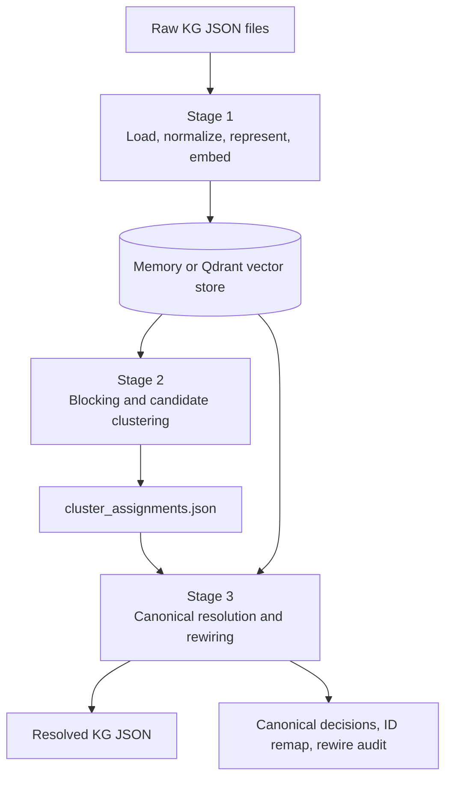

The design separates recall from precision:

- Stage 2 groups plausible duplicates.
- Stage 3 decides what actually merges and rewrites relationships.

Primary files:

- `services/entity_resolution/cli.py`
- `services/entity_resolution/pipeline.py`
- `services/entity_resolution/config.py`
- `services/entity_resolution/types.py`
- `services/entity_resolution/pipelines/stage1_pipeline.py`
- `services/entity_resolution/pipelines/stage2_pipeline.py`
- `services/entity_resolution/pipelines/stage3_pipeline.py`
- `services/entity_resolution/merging/rewire.py`

### `services/neo4j_import`

The import service loads resolved graph JSON into Neo4j.

It is responsible for:

- Creating useful search indexes.
- Merging nodes by primary label and ID.
- Merging relationships by `(source, target, type)`.
- Preserving and enriching searchable properties.

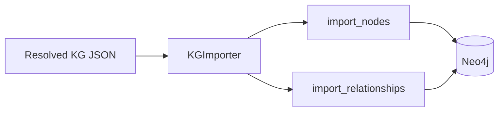

Primary file:

- `services/neo4j_import/import_to_neo4j.py`

### `services/rag_system`

`rag_system` is the runtime query layer used by the chat API and CLI. It combines two evidence stores:

- Qdrant for Markdown chunks.
- Neo4j for entities and relationships.

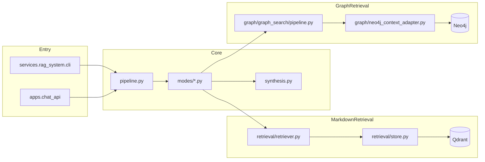

Primary files:

- `services/rag_system/pipeline.py`
- `services/rag_system/config.py`
- `services/rag_system/schemas.py`
- `services/rag_system/synthesis.py`
- `services/rag_system/modes/*.py`
- `services/rag_system/retrieval/*.py`
- `services/rag_system/graph/graph_search/*.py`

### `services/triplet_evaluation`

Triplet evaluation measures graph quality after Neo4j import. It samples graph relationships, gathers local evidence, asks an LLM judge whether each triplet is supported, contradicted, or insufficiently supported, and writes aggregate metrics.

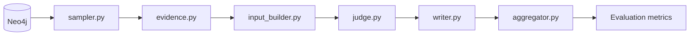

Primary files:

- `services/triplet_evaluation/cli.py`
- `services/triplet_evaluation/evaluator.py`
- `services/triplet_evaluation/sampler.py`
- `services/triplet_evaluation/evidence.py`
- `services/triplet_evaluation/judge.py`
- `services/triplet_evaluation/aggregator.py`

### `services/llms`

`llms` provides a shared provider abstraction so other services can call different LLM backends through one interface.

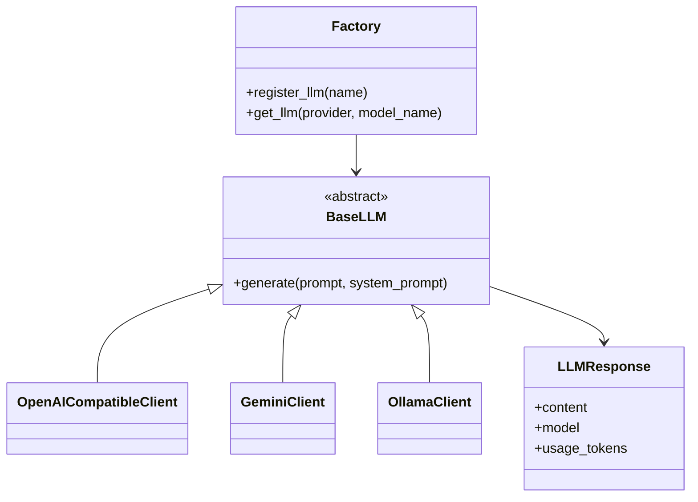

Primary files:

- `services/llms/base.py`
- `services/llms/factory.py`
- `services/llms/types.py`
- `services/llms/clients/*`

## Operational Flow

A typical full run looks like:

```bash
# 1. Crawl or prepare Markdown
python -m services.crawler.main

# 2. Extract raw KG JSON
python -m services.extraction.cli \
  --input-dir data/raw/uet \
  --output-dir data/extracted

# 3. Resolve duplicate entities
python -m services.entity_resolution.cli \
  --stage all \
  --input-dir data/extracted \
  --store-backend memory \
  --run-id demo_run

# 4. Import resolved graph into Neo4j
python -m services.neo4j_import.import_to_neo4j

# 5. Query through RAG
python -m services.rag_system.cli

# 6. Evaluate graph triplets
python -m services.triplet_evaluation.cli
```

Exact arguments may vary by local config and environment variables.

## Configuration

Configuration is split between shared settings and service-specific config modules:

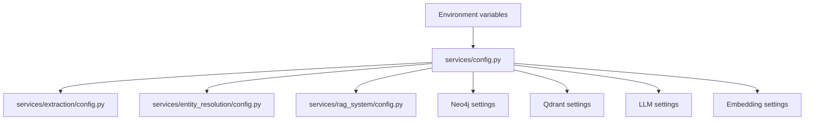

Important configuration areas:

- Neo4j URI/user/password.
- Qdrant URL and collection names.
- LLM provider/model/temperature/max tokens.
- Embedding model/dimension/batch size.
- RAG chunking and retrieval limits.
- Evaluation input/output paths.

## Mental Model

The system has two major phases:

1. **Build-time KG pipeline**
   - Crawl -> Markdown -> Extract KG -> Resolve entities -> Import Neo4j.

2. **Runtime answer/evaluation pipeline**
   - RAG queries Neo4j and/or Qdrant.
   - Triplet evaluation samples Neo4j and judges KG quality.

The shared `llms` module supports both phases, while Neo4j and Qdrant are the durable stores that connect offline processing to online retrieval.
