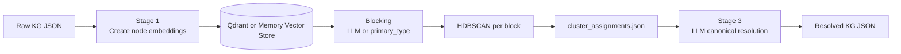
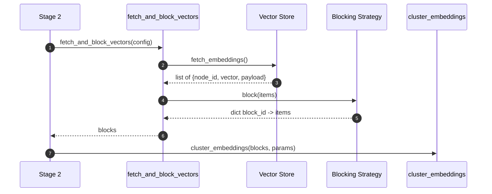
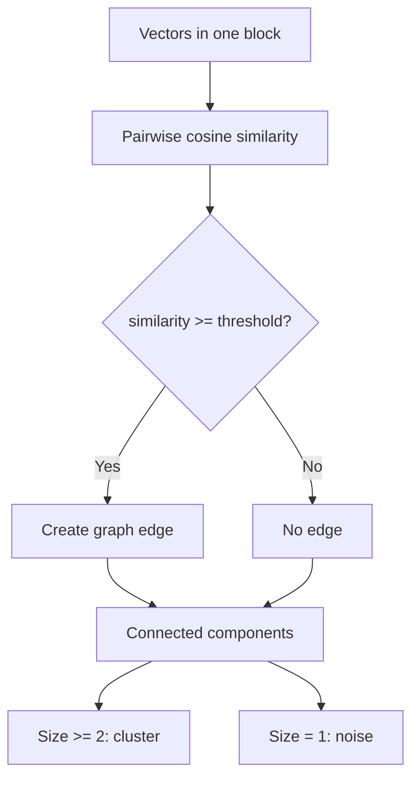
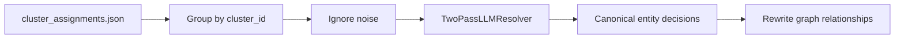
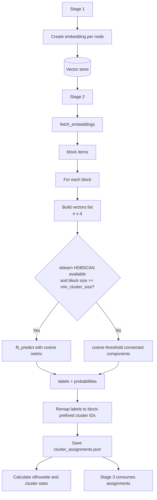

# HDBSCAN Vector Clustering trong Entity Resolution

## Overview

Trong dự án này, HDBSCAN được dùng ở **Stage 2** của pipeline `services/entity_resolution` để gom các entity có embedding vector gần nhau thành các cụm ứng viên trùng lặp. Kết quả Stage 2 chưa quyết định merge cuối cùng; nó chỉ tạo `cluster_assignments.json` để **Stage 3** dùng LLM và các bước kiểm tra bảo thủ hơn trước khi rewrite graph.



Relevant files:

- `services/entity_resolution/pipelines/stage1_pipeline.py`
- `services/entity_resolution/blocking/vector_fetch.py`
- `services/entity_resolution/clustering/cluster.py`
- `services/entity_resolution/pipelines/stage2_pipeline.py`
- `services/entity_resolution/evaluation/metrics.py`
- `services/entity_resolution/pipelines/stage3_pipeline.py`

## HDBSCAN nằm ở đâu?

HDBSCAN được gọi trong:

```text
services/entity_resolution/clustering/cluster.py
```

Function chính:

```python
cluster_embeddings(
    blocks: dict[str, list[dict]],
    min_cluster_size: int,
    min_samples: int,
    similarity_threshold: float,
) -> list[ClusterAssignment]
```

Trong function này, mỗi block entity được cluster riêng:

```python
model = SklearnHDBSCAN(
    min_cluster_size=min_cluster_size,
    min_samples=min_samples,
    metric="cosine",
    allow_single_cluster=True,
)
vectors = [x["vector"] for x in gitems]
labels = list(model.fit_predict(vectors))
probabilities = list(getattr(model, "probabilities_", [1.0] * len(gitems)))
```

Điểm quan trọng:

- Dự án dùng `sklearn.cluster.HDBSCAN`, không phải package `hdbscan` riêng.
- Metric được dùng là `cosine`.
- Input truyền vào HDBSCAN là list vector dạng `list[list[float]]`.
- HDBSCAN chạy **trong từng block**, không chạy trên toàn bộ entity cùng lúc.
- Nếu `sklearn.cluster.HDBSCAN` không import được hoặc block quá nhỏ, code chuyển sang fallback clustering bằng cosine threshold.

## Vector đi vào HDBSCAN như thế nào?

### 1. Stage 1 tạo embedding vector cho từng node

Stage 1 đọc raw KG JSON, lấy từng node, chuẩn hóa metadata và tạo embedding text. Sau đó mỗi node được biến thành một vector số thực.

Mỗi item vector có shape logic như sau:

```python
{
    "node_id": "...",
    "vector": [0.012, -0.034, 0.98, ...],
    "payload": {
        "primary_type": "...",
        "labels": [...],
        "properties": {...},
        "source_file": "...",
        "chunk_id": "..."
    }
}
```

Về mặt toán học, nếu có `n` entity trong một block và mỗi embedding có `d` chiều, HDBSCAN nhận vào ma trận:

```text
X = [
  v1,
  v2,
  v3,
  ...,
  vn
]

Shape: n x d
```

Trong code, ma trận này không được lưu thành biến NumPy ở bước clustering. Nó được truyền trực tiếp dưới dạng Python list:

```python
vectors = [x["vector"] for x in gitems]
model.fit_predict(vectors)
```

Scikit-learn sẽ tự xử lý input này như một matrix 2D.

### 2. Vector được lưu vào vector store

Sau Stage 1, vector được lưu vào một trong hai backend:

- `memory`: lưu trực tiếp trong process Python.
- `qdrant`: lưu vào Qdrant collection.

Stage 2 lấy lại vector qua:

```text
services/entity_resolution/blocking/vector_fetch.py
```

Flow:



### 3. Blocking chia nhỏ ma trận trước khi cluster

Dự án không đưa toàn bộ vector vào một ma trận lớn rồi chạy HDBSCAN. Thay vào đó, nó dùng blocking trước:

```python
blocks = strategy.block(items)
```

Kết quả là:

```python
{
    "BLOCK_A": [item1, item2, item3],
    "BLOCK_B": [item4, item5],
    "BLOCK_C": [item6, item7, item8, item9],
}
```

Sau đó `cluster_embeddings` chạy HDBSCAN riêng cho từng block.

Lý do làm vậy:

1. **Giảm nhiễu**: entity khác loại không nên bị so sánh quá nhiều với nhau.
2. **Giảm chi phí**: clustering từng block nhỏ rẻ hơn clustering toàn bộ matrix lớn.
3. **Tăng precision**: Stage 2 chỉ nên gom các entity có khả năng trùng, không nên tạo cụm quá rộng.

Hiện có hai blocking strategy:

- `LLMBlockingStrategy`: dùng LLM để quyết định block.
- `PrimaryTypeBlockingStrategy`: fallback theo `primary_type`.

Config liên quan:

```python
enable_llm_blocking: bool = True
```

## HDBSCAN hoạt động như thế nào trên vector matrix?

HDBSCAN là thuật toán clustering dựa trên mật độ. Thay vì yêu cầu số cụm cố định như KMeans, nó tìm các vùng có mật độ điểm cao trong không gian vector.

Trong dự án này:

```python
metric="cosine"
```

Nghĩa là khoảng cách giữa hai vector được hiểu theo cosine distance:

```text
cosine_similarity(a, b) = dot(a, b) / (||a|| * ||b||)
cosine_distance(a, b) = 1 - cosine_similarity(a, b)
```

Hai entity càng giống nhau về embedding thì cosine similarity càng cao, cosine distance càng thấp.

### Input

Với một block gồm `n` entity:

```text
entity_1 -> vector_1
entity_2 -> vector_2
entity_3 -> vector_3
...
entity_n -> vector_n
```

HDBSCAN nhận:

```text
X_block: n x d
```

Trong đó:

- `n`: số entity trong block.
- `d`: số chiều embedding, lấy từ `config.embedding_dim`.

### Output

HDBSCAN trả về `labels`:

```python
labels = model.fit_predict(vectors)
```

Ví dụ:

```python
labels = [0, 0, -1, 1, 1]
```

Ý nghĩa:

| Entity | Label | Ý nghĩa |
|---|---:|---|
| entity_1 | `0` | Thuộc cụm local `0` |
| entity_2 | `0` | Cùng cụm với `entity_1` |
| entity_3 | `-1` | Noise, không thuộc cụm nào |
| entity_4 | `1` | Thuộc cụm local `1` |
| entity_5 | `1` | Cùng cụm với `entity_4` |

Label `-1` là convention của HDBSCAN/sklearn cho noise point.

Ngoài label, code lấy thêm xác suất/thang confidence:

```python
probabilities = list(getattr(model, "probabilities_", [1.0] * len(gitems)))
```

`probabilities_` thể hiện mức độ chắc chắn của việc một point thuộc cluster được gán. Nếu sklearn object không có attribute này, code fallback về `1.0`.

## Các tham số HDBSCAN trong dự án

Các tham số mặc định nằm trong `services/entity_resolution/config.py`:

```python
min_cluster_size: int = 2
min_samples: int = 1
cluster_similarity_threshold: float = 0.72
```

Trong HDBSCAN path, hai tham số chính là:

```python
min_cluster_size=2
min_samples=1
```

### `min_cluster_size`

`min_cluster_size` là kích thước nhỏ nhất để một vùng được xem là cluster.

Trong dự án:

```python
min_cluster_size = 2
```

Điều này hợp lý cho entity resolution vì một duplicate cluster nhỏ nhất thường chỉ cần 2 entity.

Nếu tăng lên `3` hoặc `4`:

- Ít cluster hơn.
- Nhiều điểm bị đánh dấu noise hơn.
- Precision có thể tăng, recall có thể giảm.

Nếu giữ `2`:

- Dễ bắt các cặp duplicate hơn.
- Có thể sinh nhiều candidate cluster hơn cho Stage 3 kiểm tra.

### `min_samples`

`min_samples` ảnh hưởng đến độ bảo thủ của density estimation.

Trong dự án:

```python
min_samples = 1
```

Điều này làm clustering ít bảo thủ hơn, phù hợp với mục tiêu Stage 2 là tạo candidate duplicate có recall tốt. Stage 3 mới là nơi quyết định merge precision cao hơn.

Nếu tăng `min_samples`:

- HDBSCAN sẽ nghiêm ngặt hơn.
- Nhiều point thành noise hơn.
- Có thể bỏ lỡ duplicate cluster nhỏ.

### `allow_single_cluster=True`

Tham số này cho phép HDBSCAN trả về một cluster duy nhất trong một block nếu dữ liệu phù hợp.

Điều này quan trọng vì sau blocking, một block có thể thực sự chỉ chứa một nhóm entity cùng loại/cùng nghĩa. Nếu không cho single cluster, HDBSCAN có thể buộc phải xem nhiều điểm là noise trong một số trường hợp.

### `metric="cosine"`

Embedding vector thường được so sánh bằng cosine similarity thay vì Euclidean distance. Vì vậy code dùng:

```python
metric="cosine"
```

Điều này làm HDBSCAN nhóm entity theo hướng/ngữ nghĩa của vector thay vì độ lớn tuyệt đối của vector.

## Cách cluster ID được tạo

HDBSCAN trả về label local như `0`, `1`, `2`. Dự án không lưu trực tiếp label này. Code remap label thành cluster ID có prefix block:

```python
label_remap[label] = f"{block_key.lower()}_{next_local:04d}"
```

Ví dụ:

```text
block_key = "ORGANIZATION"
label = 0
cluster_id = "organization_0000"
```

Nếu label là `-1`, cluster ID được set thành:

```text
noise
```

Mỗi output assignment có dạng:

```json
{
  "node_id": "...",
  "cluster_id": "organization_0000",
  "probability": 0.87,
  "primary_type": "ORGANIZATION"
}
```

File output chính:

```text
data/entity_resolution/artifacts/<run_id>/stage2/cluster_assignments.json
```

Stage 2 cũng ghi thêm bản enriched:

```text
data/entity_resolution/artifacts/<run_id>/stage2/cluster_assignments_enriched.json
```

Bản enriched thêm thông tin dễ đọc như:

- `node_name`
- `labels`
- `source_file`
- `chunk_id`

## Fallback clustering khi không dùng được HDBSCAN

Trong `cluster.py`, nếu không import được sklearn HDBSCAN hoặc block quá nhỏ, code dùng fallback:

```python
labels, probabilities = _fallback_cluster(gitems, similarity_threshold)
```

Điều kiện dùng HDBSCAN:

```python
if SklearnHDBSCAN is not None and len(gitems) >= max(2, min_cluster_size):
```

Nếu không thỏa điều kiện này, fallback được dùng.

Fallback hoạt động như sau:

1. Lấy vector của tất cả item trong block.
2. Tính cosine similarity cho từng cặp vector.
3. Nếu similarity >= `cluster_similarity_threshold`, nối hai điểm bằng một cạnh.
4. Tìm connected components trên graph đó.
5. Component có từ 2 node trở lên thành cluster.
6. Component chỉ có 1 node bị đánh dấu `noise`.



Config fallback:

```python
cluster_similarity_threshold: float = 0.72
```

Trong fallback, probability được set đơn giản:

- `0.9` cho point thuộc cluster.
- `0.0` cho noise.

## Stage 2 không tự validate merge

Một điểm quan trọng trong code:

```python
# Stage 2 responsibility: Blocking + Clustering only
# All validation is handled by Stage 3 Two-Pass LLM (has full context)
```

Nghĩa là cluster từ HDBSCAN không có nghĩa là các entity chắc chắn sẽ bị merge. Nó chỉ nói rằng các entity này là **ứng viên duplicate** dựa trên vector similarity/density.

Stage 3 sẽ đọc `cluster_assignments.json`, bỏ qua noise, rồi xử lý từng cluster bằng resolver:



Điều này giúp pipeline tránh việc merge sai chỉ vì embedding gần nhau.

## Metrics sau clustering

Sau khi cluster xong, Stage 2 gọi:

```python
calculate_cluster_metrics(all_items, assignments)
```

Trong `services/entity_resolution/evaluation/metrics.py`, vectors được chuyển thành NumPy matrix:

```python
vectors = np.array([x["vector"] for x in items])
labels = np.array([a.cluster_id for a in assignments])
```

Noise bị loại khỏi silhouette calculation:

```python
mask = labels != "noise"
```

Nếu có ít nhất 2 non-noise point và ít nhất 2 cluster, code tính:

```python
silhouette_score(filtered_vectors, numeric_labels, metric="cosine")
```

Silhouette score đo mức độ tách biệt của cluster:

- Gần `1`: cluster tách tốt.
- Gần `0`: cluster chồng lấn/khó phân biệt.
- Âm: nhiều điểm có thể nằm gần cluster khác hơn cluster hiện tại.

Output metrics được ghi vào:

```text
data/entity_resolution/artifacts/<run_id>/stage2/cluster_metrics.json
```

Stage 2 cũng tạo dashboard:

```text
data/entity_resolution/artifacts/<run_id>/stage2/cluster_dashboard.html
```

## Ví dụ trực quan

Giả sử sau blocking, block `ORGANIZATION` có 6 entity:

```text
1. Trường Đại học Công nghệ
2. UET
3. University of Engineering and Technology
4. Đại học Quốc gia Hà Nội
5. VNU
6. Khoa Công nghệ Thông tin
```

Embedding matrix trong block có dạng:

```text
X_ORGANIZATION = [
  vector("Trường Đại học Công nghệ"),
  vector("UET"),
  vector("University of Engineering and Technology"),
  vector("Đại học Quốc gia Hà Nội"),
  vector("VNU"),
  vector("Khoa Công nghệ Thông tin"),
]
```

HDBSCAN có thể trả:

```python
labels = [0, 0, 0, 1, 1, -1]
```

Sau remap cluster ID:

| Entity | HDBSCAN label | Project cluster ID |
|---|---:|---|
| Trường Đại học Công nghệ | `0` | `organization_0000` |
| UET | `0` | `organization_0000` |
| University of Engineering and Technology | `0` | `organization_0000` |
| Đại học Quốc gia Hà Nội | `1` | `organization_0001` |
| VNU | `1` | `organization_0001` |
| Khoa Công nghệ Thông tin | `-1` | `noise` |

Stage 3 sau đó mới quyết định trong `organization_0000` entity nào thật sự merge thành canonical entity nào.

## Vì sao dùng HDBSCAN cho entity resolution?

HDBSCAN phù hợp hơn KMeans trong bài toán này vì:

1. **Không cần biết trước số cluster**  
   Số cụm duplicate trong mỗi block không biết trước.

2. **Có khái niệm noise**  
   Nhiều entity không trùng với ai cả. HDBSCAN có thể gán chúng là `-1` thay vì ép vào một cluster.

3. **Hỗ trợ cluster kích thước không đều**  
   Có duplicate cluster chỉ 2 entity, nhưng cũng có cluster nhiều alias/tên viết tắt.

4. **Phù hợp vai trò Stage 2**  
   Stage 2 cần tạo candidate cluster dựa trên mật độ vector; Stage 3 mới kiểm chứng semantic/context bằng LLM.

## Những điều cần chú ý khi debug

### 1. Quá nhiều noise

Nếu nhiều node bị `cluster_id = "noise"`, nguyên nhân có thể là:

- Blocking quá hẹp, mỗi block quá ít item.
- Embedding không đủ tốt.
- `min_samples` quá cao nếu đã chỉnh config.
- Entity text representation ở Stage 1 thiếu thông tin.

Trong config hiện tại `min_cluster_size=2`, `min_samples=1`, nên nếu vẫn nhiều noise thì thường nên kiểm tra blocking và embedding text trước.

### 2. Cluster quá rộng

Nếu một cluster chứa nhiều entity không nên merge:

- HDBSCAN đang gom candidate hơi rộng.
- Blocking có thể quá rộng.
- Embedding representation có thể làm nhiều entity khác nhau trông giống nhau.

Tuy nhiên, đây chưa chắc là bug nghiêm trọng vì Stage 3 vẫn có trách nhiệm validate merge.

### 3. Silhouette score không có giá trị

`silhouette_score` có thể là `None` nếu:

- Không có đủ cluster non-noise.
- Chỉ có một cluster.
- Tất cả hoặc gần như tất cả là noise.
- `sklearn.metrics.silhouette_score` không khả dụng.

### 4. Kết quả khác nhau giữa HDBSCAN và fallback

HDBSCAN dựa trên density structure, còn fallback dựa trên connected components với cosine threshold. Hai cách này có thể cho kết quả khác nhau:

- HDBSCAN có thể đánh noise tốt hơn.
- Fallback dễ tạo chain cluster: A giống B, B giống C, dù A không quá giống C.

## Tóm tắt flow thực tế trong code



Nói ngắn gọn: trong dự án này, HDBSCAN nhận từng ma trận vector nhỏ theo block, dùng cosine distance để tìm các vùng entity embedding dày đặc, trả về cluster label hoặc noise, rồi Stage 2 ghi assignment để Stage 3 quyết định merge canonical cuối cùng.
