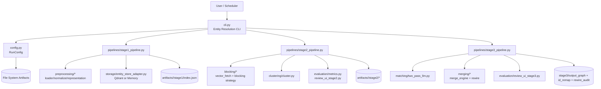
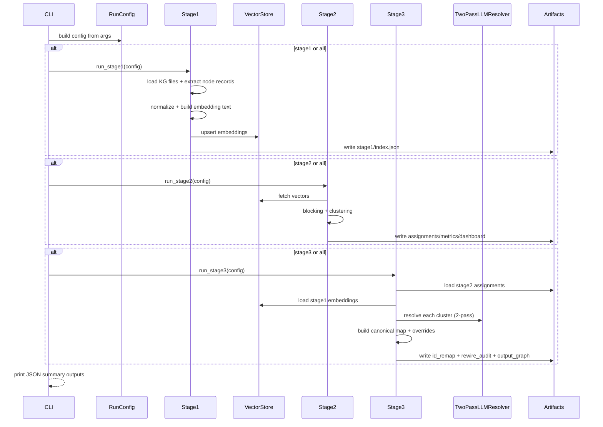

# Entity Resolution Pipeline Service

## Overview
`services/entity_resolution` là pipeline chuẩn hóa và hợp nhất thực thể (Entity Resolution) theo 3 stage: indexing embeddings, clustering ứng viên trùng, và hợp nhất canonical entities + rewire graph.
Module hỗ trợ cấu hình LLM/vector store linh hoạt, sinh artifacts theo `run_id`, và xuất các file audit/metrics phục vụ đánh giá chất lượng.

## Quick Start

```bash
# Chạy full pipeline (stage1 + stage2 + stage3)
python -m services.entity_resolution.cli \
  --input-dir mock_data \
  --artifacts-dir data/entity_resolution/artifacts \
  --store-backend qdrant \
  --qdrant-url http://localhost:6333 \
  --embedding-model paraphrase-multilingual-mpnet-base-v2 \
  --embedding-dim 768 \
  --llm-provider 9router \
  --llm-model cx/gpt-5.3-codex \
  --stage all
```

Ví dụ chỉ chạy Stage 2:

```bash
python -m services.entity_resolution.cli --stage stage2
```

Một số tham số quan trọng:
- `--stage`: `stage1 | stage2 | stage3 | all`
- `--enable-llm-blocking` / `--no-llm-blocking`: bật/tắt blocking strategy bằng LLM ở Stage 2
- `--cluster-threshold`, `--min-cluster-size`, `--min-samples`: điều chỉnh clustering
- `--store-backend`: `qdrant` hoặc `memory`

## Architecture (detailed architecture diagram)
Kiến trúc module gồm các lớp chính:
1. **CLI Layer (`cli.py`)**: parse args, dựng `RunConfig`, gọi stage tương ứng.
2. **Config Layer (`config.py`)**: quản lý tham số runtime (`run_id`, embedding, clustering, LLM, storage).
3. **Stage 1 – Representation & Indexing**: load KG nodes, normalize, tạo embedding, index vào vector store.
4. **Stage 2 – Blocking & Clustering**: fetch vectors, chia block, clustering, xuất assignments + metrics/dashboard.
5. **Stage 3 – Resolution & Rewiring**: resolve canonical entities bằng 2-pass LLM, tạo `id_remap`, rewire graph, ghi audit.
6. **Support Modules**: `preprocessing`, `blocking`, `clustering`, `matching`, `merging`, `storage`, `evaluation`.

### Component Diagram



### Runtime Sequence Diagram



## Project Structure
```text
services/entity_resolution/
├── cli.py                # Entry point chạy pipeline theo stage
├── config.py             # RunConfig và quản lý artifacts theo run_id
├── types.py              # Dataclasses cho records, assignments, stage results
├── pipelines/            # Điều phối stage1/stage2/stage3
│   ├── stage1_pipeline.py
│   ├── stage2_pipeline.py
│   └── stage3_pipeline.py
├── preprocessing/        # Load dữ liệu, normalize, embedding representation
├── storage/              # Adapter vector store (Qdrant/Memory)
├── blocking/             # Blocking strategy trước clustering
├── clustering/           # Thuật toán clustering embeddings
├── matching/             # 2-pass LLM resolver cho entity matching
├── merging/              # Merge canonical entities và rewire graph
├── evaluation/           # Metrics + dashboard/review UI
├── utils/                # Utilities (ví dụ canonical id builder)
└── tests/                # Unit/integration tests
```