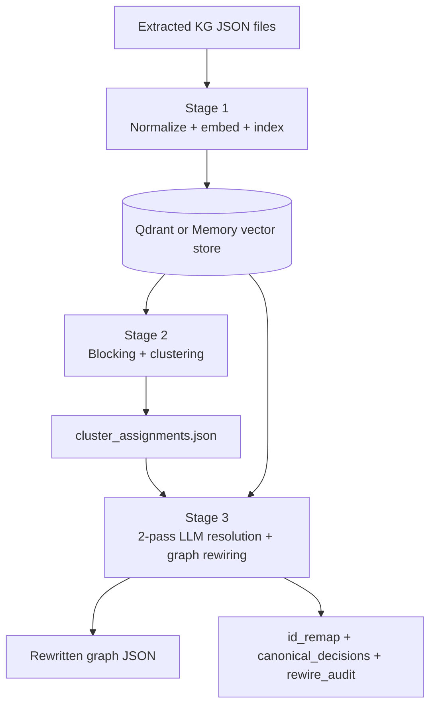
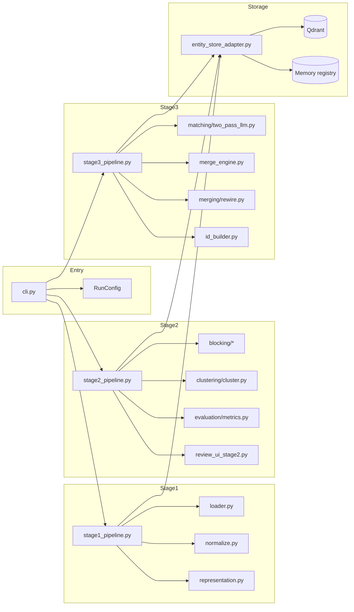
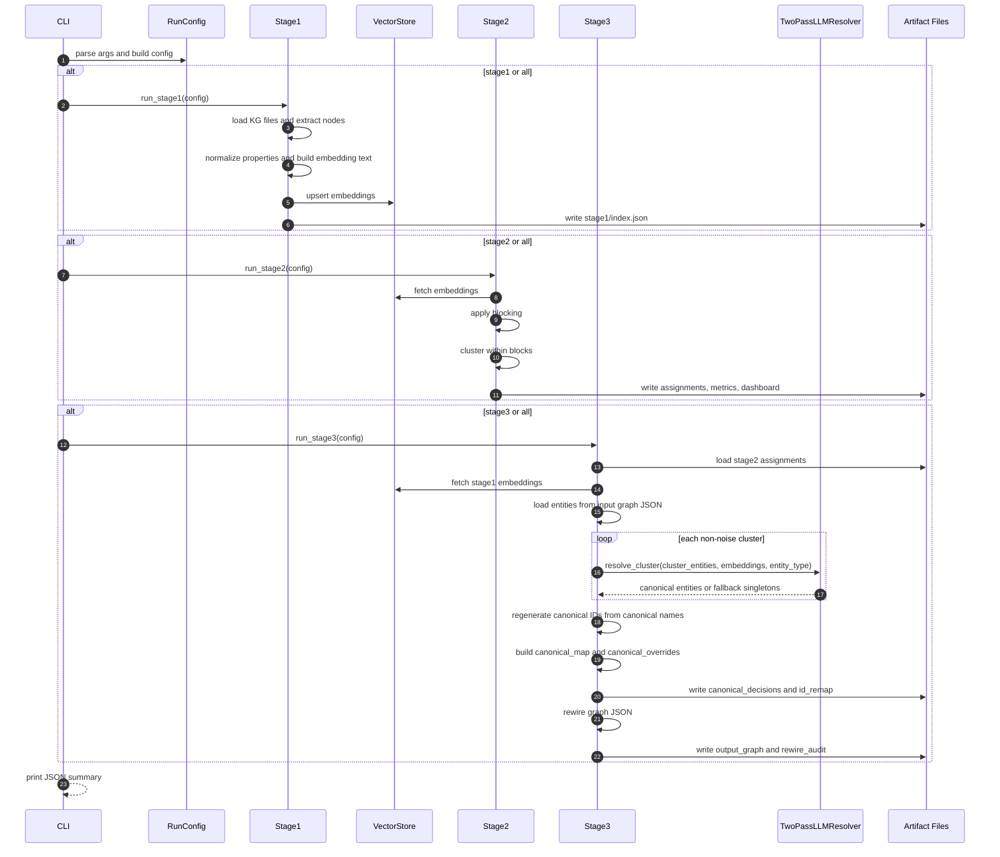
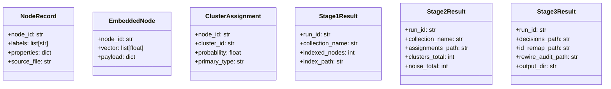
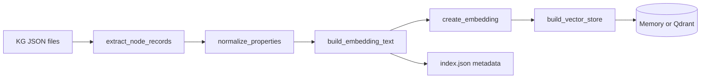
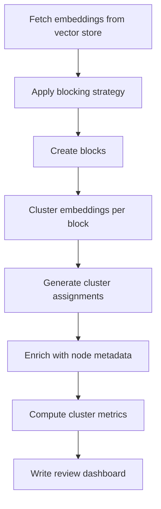
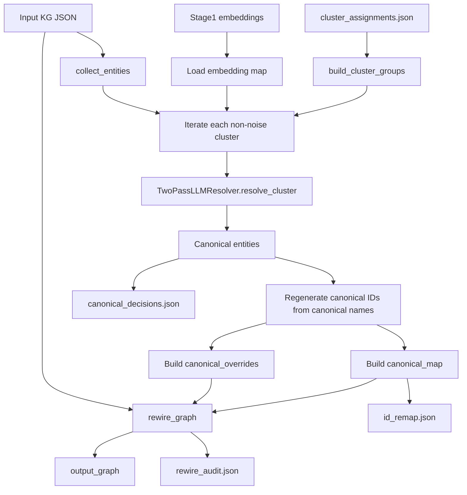
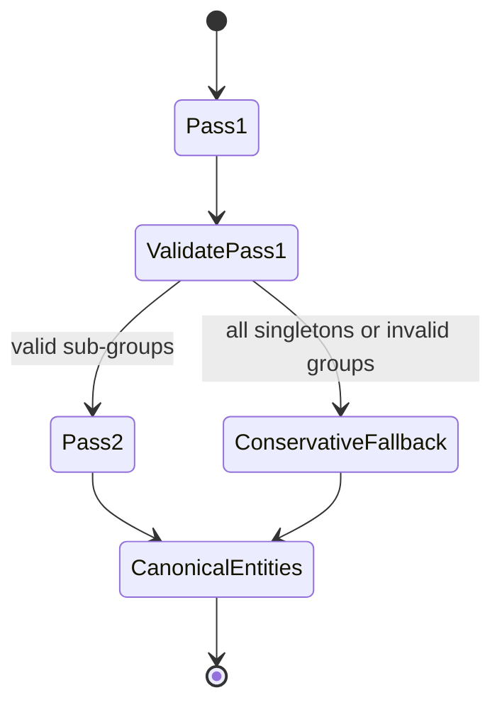
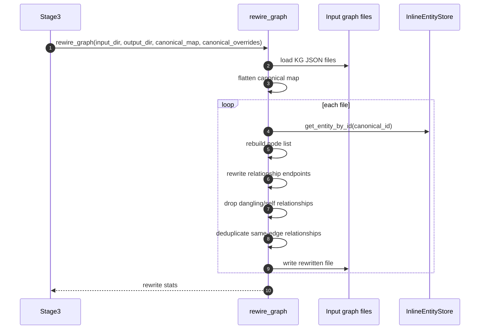

# Entity Resolution Pipeline

## Overview

`services/entity_resolution` deduplicates extracted graph entities before Neo4j import. It exists to turn noisy, document-local nodes into cleaner canonical entities, while preserving traceability through artifacts such as cluster assignments, canonical decisions, ID remaps, and rewiring audits.

The package is intentionally split into three stages:

1. **Stage 1**: load extracted graph nodes, normalize them, build embedding text, and index vectors
2. **Stage 2**: block and cluster candidate duplicates
3. **Stage 3**: resolve clusters into canonical entities and rewrite graph JSON with canonical IDs



## Why this service exists

Extraction produces many near-duplicate nodes because the same real-world entity can appear with:

- different surface forms
- abbreviations and full names
- aliases from different source chunks
- partially overlapping descriptions

This pipeline separates **recall-oriented grouping** from **precision-oriented resolution**:

- Stage 2 groups plausible duplicates together
- Stage 3 decides what should truly merge and how the canonical entity should look

## Public entrypoint

The CLI entrypoint is `services/entity_resolution/cli.py`. It builds a `RunConfig` and runs one or more stages:

- `stage1`
- `stage2`
- `stage3`
- `all`

Relevant file:
- `services/entity_resolution/cli.py:12`

## Package structure

```text
services/entity_resolution/
  cli.py
  config.py
  types.py
  README.md
  pipelines/
    stage1_pipeline.py
    stage2_pipeline.py
    stage3_pipeline.py
  preprocessing/
    loader.py
    logger.py
    normalize.py
    representation.py
  blocking/
    vector_fetch.py
    primary_type_blocking.py
    llm_blocking_strategy.py
  clustering/
    cluster.py
  matching/
    two_pass_llm.py
    fuzzy_validation.py
  merging/
    merge_engine.py
    rewire.py
  storage/
    entity_store_adapter.py
    review_store.py
  evaluation/
    metrics.py
    review_ui_stage2.py
    review_ui_stage3.py
  utils/
    canonical_name_selector.py
    id_builder.py
  tests/
    test_stage3_under_merge.py
    test_two_pass_llm_detailed.py
    ...
```

## Key concepts

### 1. `run_id` scopes every execution

Artifacts are isolated by `run_id`, and stage outputs are written under:

```text
data/entity_resolution/artifacts/<run_id>/stage1
data/entity_resolution/artifacts/<run_id>/stage2
data/entity_resolution/artifacts/<run_id>/stage3
```

Relevant file:
- `services/entity_resolution/config.py:50`

### 2. Vector storage is pluggable

The pipeline supports two vector backends:

- `memory`: ephemeral, process-local storage
- `qdrant`: persistent vector storage in Qdrant

This is why `stage all` is the safest mode when using the memory backend: Stage 2 and Stage 3 depend on vectors created by Stage 1.

Relevant file:
- `services/entity_resolution/storage/entity_store_adapter.py:114`

### 3. Stage 2 is recall-oriented

Stage 2 is deliberately permissive. Its job is to create candidate duplicate clusters, not to make final merge decisions.

### 4. Stage 3 is precision-oriented

Stage 3 uses a two-pass LLM resolver plus canonical-ID regeneration and graph rewiring. This is the stage that determines the final merged entity set.

## Architecture

### Runtime architecture



### End-to-end execution sequence



## Data model

`types.py` contains the primary dataclasses passed between stages.



Relevant file:
- `services/entity_resolution/types.py:6`

## Stage 1: normalize, represent, and index

Stage 1 reads extracted KG JSON files, extracts node records, normalizes properties, builds embedding text, creates vectors, and stores them in the configured backend.

### What Stage 1 writes

- `stage1/index.json`
- `stage1/stage1.log`

### Main responsibilities

- load files with `load_kg_files(...)`
- extract records with `extract_node_records(...)`
- normalize with `normalize_properties(...)`
- compute `primary_type(...)`
- generate embedding text with `build_embedding_text(...)`
- create embeddings with semantic embedding by default, falling back to hash if needed
- upsert vectors into memory or Qdrant



Relevant file:
- `services/entity_resolution/pipelines/stage1_pipeline.py:14`

## Stage 2: blocking and clustering

Stage 2 fetches vectors from the store, groups them into blocks, clusters each block, and writes cluster artifacts and review outputs.

### What Stage 2 writes

- `stage2/cluster_assignments.json`
- `stage2/cluster_assignments_enriched.json`
- `stage2/cluster_metrics.json`
- `stage2/cluster_dashboard.html`
- `stage2/stage2.log`

### Important design choice

Stage 2 does **not** perform final validation. The code explicitly treats validation as Stage 3 responsibility, because Stage 3 has more context and uses the two-pass resolver.

Relevant file:
- `services/entity_resolution/pipelines/stage2_pipeline.py:63`

### Stage 2 flow



### Blocking behavior

Blocking is configurable:

- `--enable-llm-blocking`: use LLM-guided blocking logic
- `--no-llm-blocking`: use hard-coded primary-type blocking

This affects which nodes are allowed to compete with each other during clustering.

Relevant files:
- `services/entity_resolution/pipelines/stage2_pipeline.py:20`
- `services/entity_resolution/blocking/vector_fetch.py`
- `services/entity_resolution/blocking/llm_blocking_strategy.py`
- `services/entity_resolution/blocking/primary_type_blocking.py`

## Stage 3: canonical resolution and graph rewiring

Stage 3 consumes Stage 2 clusters and Stage 1 embeddings, loads the original graph entities, resolves each cluster into canonical entities, and rewrites the extracted graph files.

### What Stage 3 writes

- `stage3/canonical_decisions.json`
- `stage3/id_remap.json`
- `stage3/rewire_audit.json`
- `stage3/synthesis_decisions.json` (compatibility placeholder)
- `stage3/output_graph/*.json`
- `stage3/stage3.log`

### Stage 3 flow



Relevant file:
- `services/entity_resolution/pipelines/stage3_pipeline.py:151`

### Two-pass LLM resolution

`matching/two_pass_llm.py` implements a simpler replacement for the older multi-step design.

- **Pass 1**: partition a cluster into sub-groups of same-entity records
- **Pass 2**: synthesize one canonical entity per multi-record sub-group

If Pass 1 produces only singletons or fails embedding-based validation, the resolver falls back conservatively instead of forcing merges.



Relevant file:
- `services/entity_resolution/matching/two_pass_llm.py:21`

### Canonical ID regeneration

After the resolver returns canonical entities, Stage 3 regenerates canonical IDs from canonical names. This keeps canonical IDs stable and readable rather than blindly trusting the resolver’s initial ID string.

It also preserves `legacy_canonical_id` for traceability.

Relevant files:
- `services/entity_resolution/pipelines/stage3_pipeline.py:248`
- `services/entity_resolution/utils/id_builder.py`

### Graph rewiring behavior

`merging/rewire.py` rewrites nodes and relationships using the canonical map.

It also:

- removes self-loops and dangling relationships
- merges duplicate relationships with identical `(source, target, type)`
- merges relationship properties conservatively
- writes per-file before/after counts for audit



Relevant file:
- `services/entity_resolution/merging/rewire.py:258`

## Configuration

`RunConfig` in `config.py` centralizes stage settings.

### Core fields

- `input_dir`
- `artifacts_dir`
- `run_id`
- `collection_name`

### Embedding

- `embedding_model`
- `embedding_dim`

### Clustering

- `min_cluster_size`
- `min_samples`
- `cluster_similarity_threshold`
- `enable_llm_blocking`

### Storage

- `store_backend`
- `qdrant_url`

### LLM

- `llm_provider`
- `llm_model`
- `llm_api_key`
- `llm_temperature`
- `llm_max_tokens`

### Conservative fallback

- `conservative_merge_threshold`
- `enable_conservative_fallback`

Relevant file:
- `services/entity_resolution/config.py:14`

## CLI reference

Common commands:

```bash
# Full run with persistent Qdrant backend
python -m services.entity_resolution.cli \
  --stage all \
  --input-dir data/extracted \
  --artifacts-dir data/entity_resolution/artifacts \
  --store-backend qdrant \
  --run-id my_run

# Full run with ephemeral memory backend
python -m services.entity_resolution.cli \
  --stage all \
  --input-dir data/extracted \
  --store-backend memory \
  --run-id demo_run

# Stage-by-stage with persistent backend
python -m services.entity_resolution.cli --stage stage1 --input-dir data/extracted --store-backend qdrant --run-id my_run
python -m services.entity_resolution.cli --stage stage2 --store-backend qdrant --run-id my_run
python -m services.entity_resolution.cli --stage stage3 --store-backend qdrant --run-id my_run
```

Important flags:

```bash
--stage stage1|stage2|stage3|all
--store-backend qdrant|memory
--qdrant-url http://localhost:6333
--cluster-threshold 0.6
--min-cluster-size 2
--min-samples 1
--enable-llm-blocking
--no-llm-blocking
--llm-provider 9router
--llm-model cx/gpt-5.3-codex
```

Relevant file:
- `services/entity_resolution/cli.py:12`

## Artifacts produced by stage

```text
artifacts/<run_id>/
  stage1/
    index.json
    stage1.log
  stage2/
    cluster_assignments.json
    cluster_assignments_enriched.json
    cluster_metrics.json
    cluster_dashboard.html
    stage2.log
  stage3/
    canonical_decisions.json
    id_remap.json
    rewire_audit.json
    synthesis_decisions.json
    output_graph/*.json
    stage3.log
```

## Testing surface

The current tests focus on regression-heavy behavior around Stage 3, canonicalization, and graph rewiring.

Examples:

- `services/entity_resolution/tests/test_stage3_under_merge.py` checks that Stage 3 produces valid merge artifacts and writes canonical decisions.
- `services/entity_resolution/tests/test_two_pass_llm_detailed.py` exercises two-pass resolution behavior.
- `services/entity_resolution/tests/test_relationship_deduplication.py` covers duplicate-edge handling.
- `services/entity_resolution/tests/test_id_builder.py` covers canonical ID generation rules.

## Troubleshooting

### Stage 2 cannot find vectors

If you run stages separately with `--store-backend memory`, Stage 2 will not see Stage 1 vectors from a previous process. Use:

- `--stage all` with `memory`, or
- `qdrant` for multi-command staged runs

Relevant file:
- `services/entity_resolution/storage/entity_store_adapter.py:17`

### Stage 3 appears to under-merge

Check:

- `cluster_assignments.json` from Stage 2
- whether Pass 1 is returning all singletons
- whether subgroup validation triggers conservative fallback
- whether `canonical_decisions.json` contains mostly `merge_count: 1`

Relevant files:
- `services/entity_resolution/matching/two_pass_llm.py:83`
- `services/entity_resolution/tests/test_stage3_under_merge.py:17`

### Canonical IDs do not match original LLM output

This is expected. Stage 3 regenerates canonical IDs from canonical names after LLM synthesis, then stores the original ID as `legacy_canonical_id`.

Relevant file:
- `services/entity_resolution/pipelines/stage3_pipeline.py:248`

### Relationships disappear after rewiring

This usually means they became:

- self-loops after canonicalization
- dangling references to removed nodes
- duplicates that were intentionally merged away

Check `rewire_audit.json` and the per-file stats returned by `rewire_graph(...)`.

Relevant file:
- `services/entity_resolution/merging/rewire.py:227`

## Source map

Primary files to read first:

- `services/entity_resolution/cli.py`
- `services/entity_resolution/config.py`
- `services/entity_resolution/pipelines/stage1_pipeline.py`
- `services/entity_resolution/pipelines/stage2_pipeline.py`
- `services/entity_resolution/pipelines/stage3_pipeline.py`
- `services/entity_resolution/matching/two_pass_llm.py`
- `services/entity_resolution/merging/rewire.py`
- `services/entity_resolution/storage/entity_store_adapter.py`
