# Entity Resolution Pipeline

## Overview

`services/entity_resolution` deduplicates extracted graph entities before Neo4j import. It exists to turn noisy, document-local nodes into cleaner canonical entities, while preserving traceability through artifacts such as cluster assignments, canonical decisions, ID remaps, and rewiring audits.

The package is intentionally split into three stages:

1. **Stage 1**: load extracted graph nodes, normalize them, build embedding text, and index vectors
2. **Stage 2**: block and cluster candidate duplicates
3. **Stage 3**: resolve clusters into canonical entities and rewrite graph JSON with canonical IDs

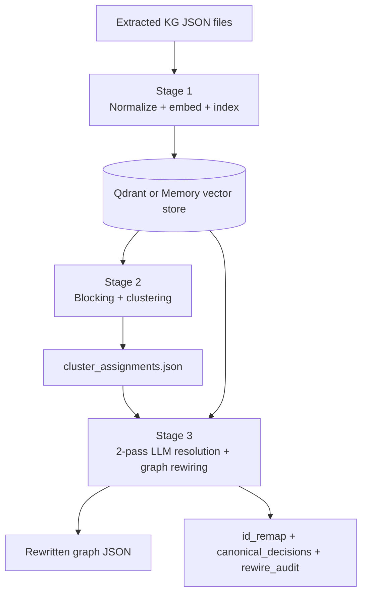

## Why this service exists

Extraction produces many near-duplicate nodes because the same real-world entity can appear with:

- different surface forms
- abbreviations and full names
- aliases from different source chunks
- partially overlapping descriptions

This pipeline separates **recall-oriented grouping** from **precision-oriented resolution**:

- Stage 2 groups plausible duplicates together
- Stage 3 decides what should truly merge and how the canonical entity should look

## Public entrypoint

The CLI entrypoint is `services/entity_resolution/cli.py`. It builds a `RunConfig` and runs one or more stages:

- `stage1`
- `stage2`
- `stage3`
- `all`

Relevant file:
- `services/entity_resolution/cli.py:12`

## Package structure

```text
services/entity_resolution/
  cli.py
  config.py
  types.py
  README.md
  pipelines/
    stage1_pipeline.py
    stage2_pipeline.py
    stage3_pipeline.py
  preprocessing/
    loader.py
    logger.py
    normalize.py
    representation.py
  blocking/
    vector_fetch.py
    primary_type_blocking.py
    llm_blocking_strategy.py
  clustering/
    cluster.py
  matching/
    two_pass_llm.py
    fuzzy_validation.py
  merging/
    merge_engine.py
    rewire.py
  storage/
    entity_store_adapter.py
    review_store.py
  evaluation/
    metrics.py
    review_ui_stage2.py
    review_ui_stage3.py
  utils/
    canonical_name_selector.py
    id_builder.py
  tests/
    test_stage3_under_merge.py
    test_two_pass_llm_detailed.py
    ...
```

## Key concepts

### 1. `run_id` scopes every execution

Artifacts are isolated by `run_id`, and stage outputs are written under:

```text
data/entity_resolution/artifacts/<run_id>/stage1
data/entity_resolution/artifacts/<run_id>/stage2
data/entity_resolution/artifacts/<run_id>/stage3
```

Relevant file:
- `services/entity_resolution/config.py:50`

### 2. Vector storage is pluggable

The pipeline supports two vector backends:

- `memory`: ephemeral, process-local storage (class-level dict in `MemoryVectorStore`)
- `qdrant`: persistent vector storage in Qdrant with `COSINE` distance metric, batched upsert (1,000 points/batch), and UUID5-based point IDs

This is why `stage all` is the safest mode when using the memory backend: Stage 2 and Stage 3 depend on vectors created by Stage 1, and the memory registry only survives within a single Python process.

Relevant file:
- `services/entity_resolution/storage/entity_store_adapter.py:114`

### 3. Stage 2 is recall-oriented

Stage 2 is deliberately permissive. Its job is to create candidate duplicate clusters, not to make final merge decisions. All validation is explicitly delegated to Stage 3.

### 4. Stage 3 is precision-oriented

Stage 3 uses a two-pass LLM resolver plus canonical-ID regeneration and graph rewiring. This is the stage that determines the final merged entity set.

## Architecture

### Runtime architecture

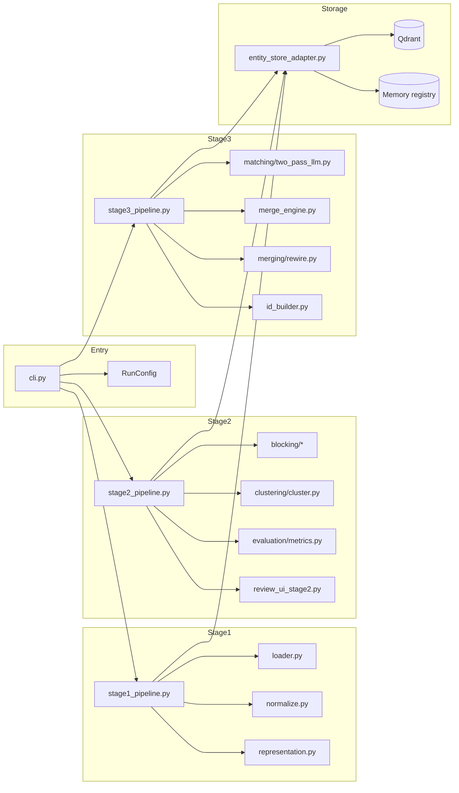

### End-to-end execution sequence

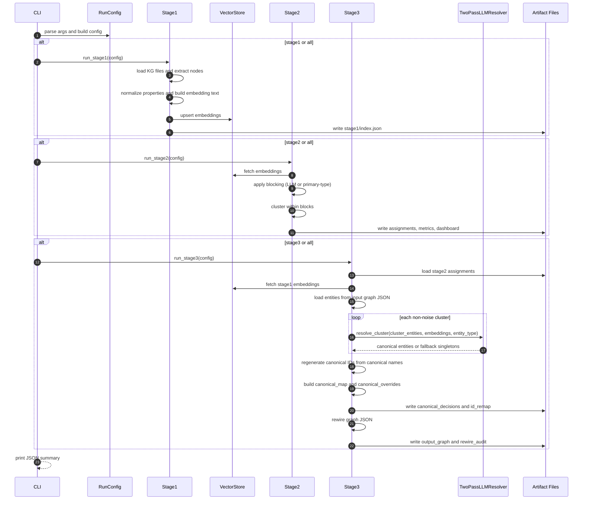

## Data model

`types.py` contains the primary dataclasses passed between stages.


Relevant file:
- `services/entity_resolution/types.py:6`

## Stage 1: normalize, represent, and index

Stage 1 reads extracted KG JSON files, extracts node records, normalizes properties, builds embedding text, creates vectors, and stores them in the configured backend.

### What Stage 1 writes

- `stage1/index.json` — metadata including all indexed node IDs, primary types, source files
- `stage1/stage1.log`

### Main responsibilities

- load files with `load_kg_files(...)` — loads all `*.json` files from the input directory
- extract records with `extract_node_records(...)` — deduplicates and merges properties of same-ID nodes across files
- normalize with `normalize_properties(...)` — normalizes aliases, strips diacritics
- compute `primary_type(...)` — maps label sets to PERSON, ORGANIZATION, ORGANIZATIONAL_UNIT, or UNKNOWN
- generate embedding text with `build_embedding_text(...)` — uses name only, with type-specific normalization (e.g., stripping academic titles from PERSON names)
- create embeddings with semantic embedding by default, falling back to stable hash (SHA256-based deterministic vector) on model failure
- upsert vectors into memory or Qdrant

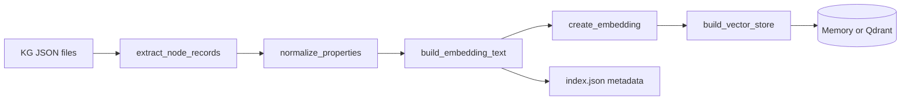

Relevant file:
- `services/entity_resolution/pipelines/stage1_pipeline.py:14`

### Preprocessing detail: normalization pipeline

Text normalization is critical for Vietnamese entity resolution. The pipeline handles:

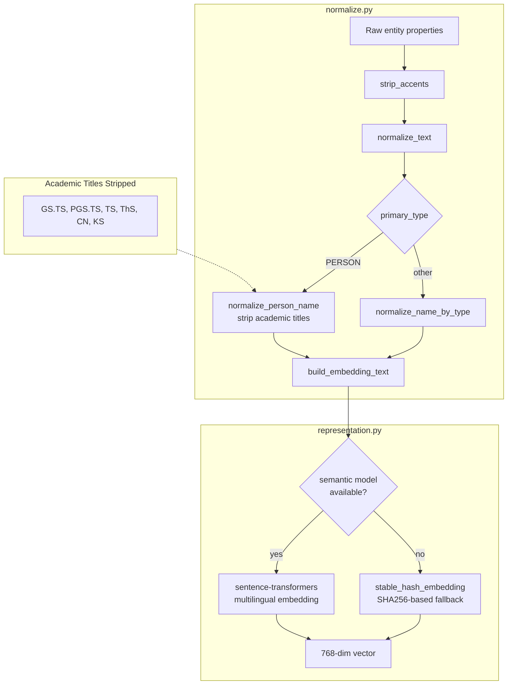

Key design points:
- **Academic title stripping**: PERSON names undergo removal of Vietnamese academic titles (`GS.TS`, `PGS.TS`, `TS`, `ThS`, `CN`, `KS`) so that "GS.TS Nguyễn Văn A" and "Nguyễn Văn A" produce identical embedding text
- **Semantic with hash fallback**: `create_embedding` is the unified interface that tries sentence-transformers first, falls back to deterministic hash
- **Model caching**: `get_embedding_model` caches the loaded model so subsequent calls reuse it

Relevant files:
- `services/entity_resolution/preprocessing/normalize.py`
- `services/entity_resolution/preprocessing/representation.py`

## Stage 2: blocking and clustering

Stage 2 fetches vectors from the store, groups them into blocks, clusters each block, and writes cluster artifacts and review outputs.

### What Stage 2 writes

- `stage2/cluster_assignments.json`
- `stage2/cluster_assignments_enriched.json`
- `stage2/cluster_metrics.json`
- `stage2/cluster_dashboard.html`
- `stage2/stage2.log`

### Important design choice

Stage 2 does **not** perform final validation. The code explicitly treats validation as Stage 3 responsibility, because Stage 3 has more context and uses the two-pass resolver.

Relevant file:
- `services/entity_resolution/pipelines/stage2_pipeline.py:63`

### Stage 2 flow

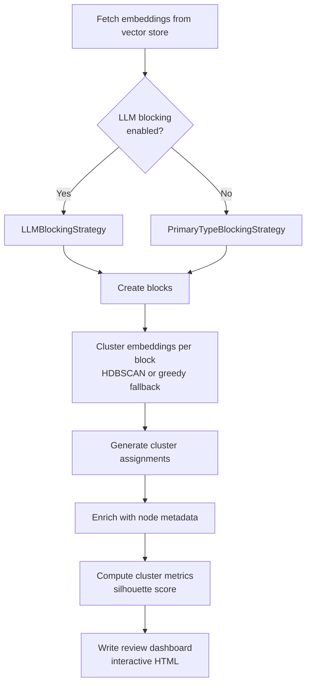

### Blocking strategies in depth

Blocking determines which nodes can compete with each other during clustering. Only nodes in the same block are compared.

#### Primary Type Blocking (hard-coded)

`--no-llm-blocking` uses `PrimaryTypeBlockingStrategy` which groups nodes by `primary_type` derived from labels:

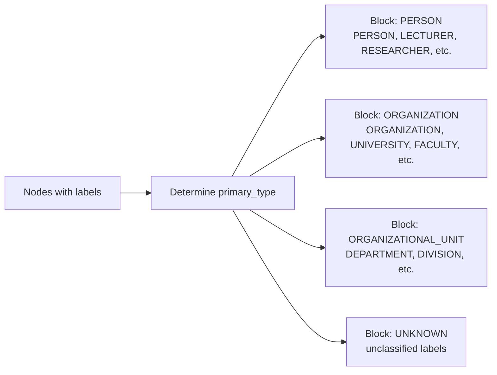

Simple and fast, but may not capture all meaningful co-reference opportunities.

#### LLM Blocking Strategy (LLM-guided)

`--enable-llm-blocking` (default: True) uses `LLMBlockingStrategy` which calls an LLM once to analyze unique label combinations and produce a blocking plan:

```mermaid
flowchart TB
    subgraph Input[Input: ~10K entities]
        A[All entity items<br/>with labels]
    end

    subgraph Extract[Extract unique labels]
        B[Deduplicate: ~10K entities<br/>→ ~20 unique label sets]
        C[Cache key:<br/>frozenset of sorted label tuples]
    end

    subgraph LLM[LLM call (once, cached)]
        D{Cache hit?}
        D -->|Yes| E[Return cached strategy]
        D -->|No| F[Send Vietnamese prompt<br/>with unique label combinations]
        F --> G[Parse JSON response]
        G --> H{Valid?}
        H -->|Yes| I[Cache and return strategy]
        H -->|No| J[Fallback: per-label-combo blocks]
    end

    subgraph Apply[Apply strategy]
        K[Build type → block_id mapping]
        L[Assign each entity to its block<br/>by matching labels]
    end

    A --> B
    B --> C
    C --> D
    I --> K
    E --> K
    J --> K
    K --> L
```

**Key design points:**
- **Drastic input reduction**: ~10,000 entities with labels → ~20 unique label combinations, reducing LLM input
- **Caching**: Strategy is cached by `frozenset` of label tuples, so repeated runs with the same entity types skip LLM calls
- **Vietnamese prompt**: LLM understands Vietnamese entity types and their co-reference patterns (e.g., "PERSON" and "LECTURER" together, "ORGANIZATIONAL_UNIT" separate from "ORGANIZATION")
- **Validation**: LLM output is validated to ensure all types are covered; missing types get warnings
- **Fallback**: If JSON parsing fails, each unique label combination gets its own block
- **Unique block assignment**: Each type belongs to exactly one block to avoid conflicts during relationship rewiring

Example LLM blocking strategy JSON:
```json
{
  "blocks": [
    {
      "block_id": "person_related",
      "types": ["PERSON", "LECTURER", "RESEARCHER"],
      "reasoning": "Các type này đều chỉ con người, có thể đồng tham chiếu"
    },
    {
      "block_id": "organization_related",
      "types": ["ORGANIZATION", "UNIVERSITY", "FACULTY"],
      "reasoning": "Các type tổ chức cấp cao, có thể có tên gọi khác nhau"
    }
  ]
}
```

Relevant file:
- `services/entity_resolution/blocking/llm_blocking_strategy.py`

### Clustering within blocks

`cluster_embeddings()` runs on each block independently:

1. **HDBSCAN** (if sklearn available and block has ≥ `min_cluster_size` items): cosine metric, `allow_single_cluster=True`
2. **Greedy graph-components fallback**: builds adjacency graph from cosine similarity threshold (default 0.72), finds connected components, discards singleton components as noise

Cluster IDs are block-prefixed (e.g., `person_related_0000`, `organization_related_0001`). Noise points get `cluster_id = "noise"` and `probability = 0.0`.

Relevant file:
- `services/entity_resolution/clustering/cluster.py`

## Stage 3: canonical resolution and graph rewiring

Stage 3 consumes Stage 2 clusters and Stage 1 embeddings, loads the original graph entities, resolves each cluster into canonical entities, and rewrites the extracted graph files.

### What Stage 3 writes

- `stage3/canonical_decisions.json`
- `stage3/id_remap.json`
- `stage3/rewire_audit.json`
- `stage3/synthesis_decisions.json` (compatibility placeholder)
- `stage3/output_graph/*.json`
- `stage3/stage3.log`

### Stage 3 flow

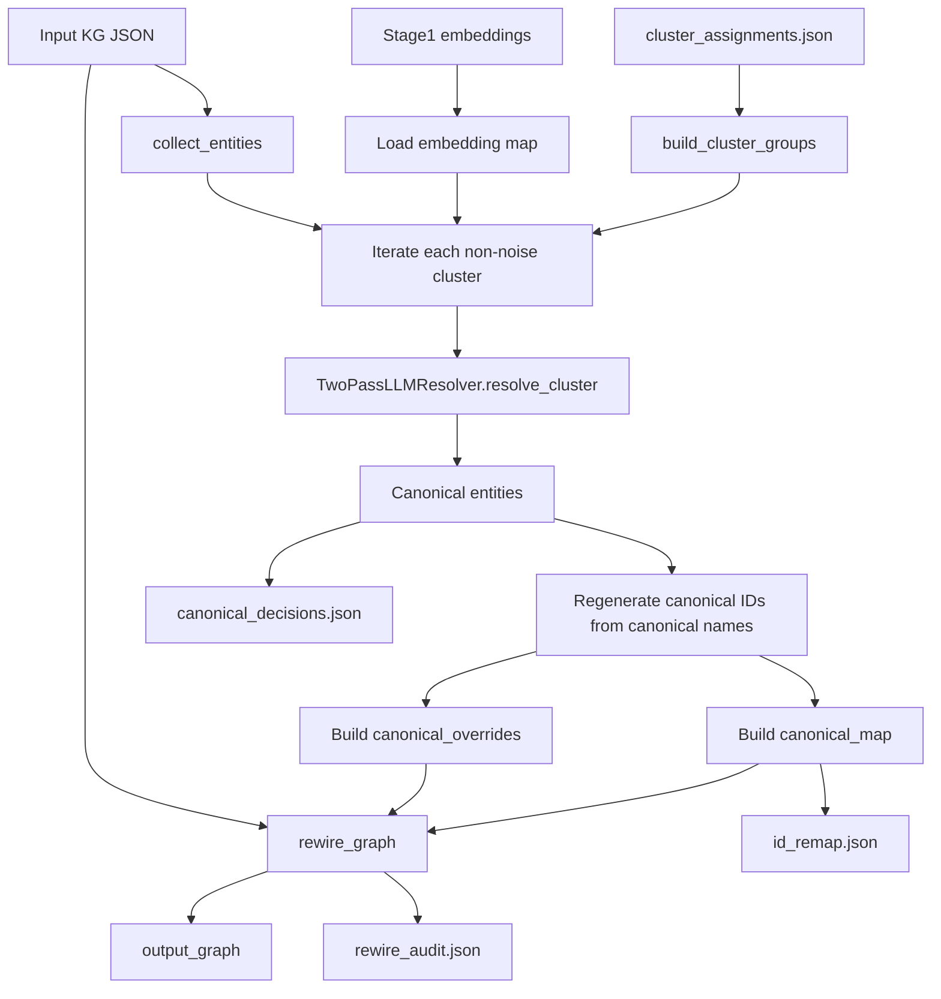

Relevant file:
- `services/entity_resolution/pipelines/stage3_pipeline.py:151`

### Two-pass LLM resolution

`matching/two_pass_llm.py` implements a two-pass approach:

- **Pass 1**: partition a cluster into sub-groups of same-entity records
- **Pass 2**: synthesize one canonical entity per multi-record sub-group

If Pass 1 produces only singletons or fails embedding-based validation, the resolver falls back conservatively instead of forcing merges.

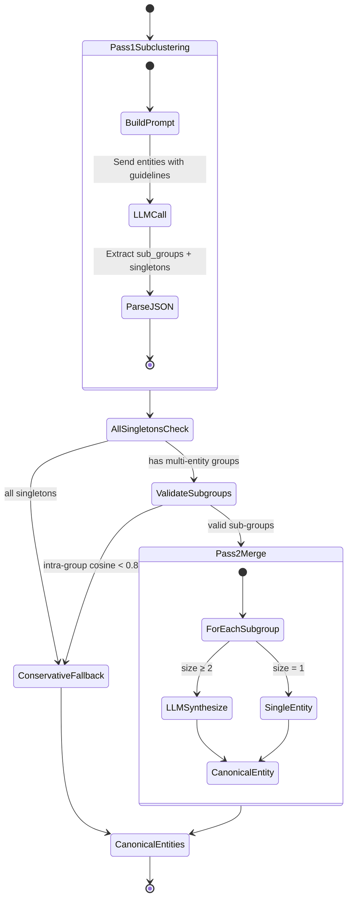

**Pass 1 guidelines** (Vietnamese prompt):
1. **Aliases are strong signals** — if entity A has an alias matching entity B's name, they likely co-refer
2. **Vietnamese abbreviations** — "ĐHCN" = "Đại học Công nghệ", "UET" = "University of Engineering and Technology", "ĐHQGHN" = "Đại học Quốc gia Hà Nội"
3. **Institutional names with/without parent** — "Trường Đại học Công nghệ" and "Trường Đại học Công nghệ, ĐHQGHN" are the same university
4. **Systematic field comparison** — names, aliases, labels, descriptions, source documents
5. **Balance precision and recall** — ambiguity alone is not reason to separate; use all available signals

**Pass 2 guidelines** (Vietnamese prompt):
1. Choose the clearest canonical name
2. Merge labels by union
3. Include all distinct aliases
4. Collect all chunk_id and model_extracted references
5. Keep informative, non-duplicate descriptions
6. Do not invent new fields or add unsupported information

**Pass 1 validation**:
- After Pass 1 returns sub-groups, compute intra-group embedding similarity (mean pairwise cosine)
- If any multi-entity sub-group has intra-similarity below threshold (0.83), the group is considered suspicious and the entire cluster triggers conservative fallback

Relevant file:
- `services/entity_resolution/matching/two_pass_llm.py:21`

### Conservative fallback

When Pass 1 fails (all singletons, or validation fails), `_conservative_fallback()` applies rule-based merging:

```mermaid
flowchart TB
    A[Cluster entities] --> B[Extract names, aliases, vectors]

    B --> C[Pairwise comparison]

    C --> D{Cosine similarity<br/>≥ threshold (0.88)?}
    D -->|No| E[Don't merge]
    D -->|Yes| F{Name or alias overlap?}

    F -->|No| G[Don't merge<br/>even if high similarity]
    F -->|Yes| H[Add to merge group]

    H --> I[Build merged canonical entity]
    I --> J[select_canonical_name<br/>scored selection algorithm]
    J --> K[build_canonical_id<br/>from canonical name]
    K --> L[Output: merged entity<br/>with merged_from list]
```

**Key rules:**
1. Only merge if cosine similarity ≥ `conservative_merge_threshold` (default 0.88)
2. Only merge if name or alias overlap exists (exact set intersection OR substring match)
3. Name/alias overlap is a hard requirement — high similarity without name overlap won't trigger a merge (prevents false positives from similar but unrelated entities)
4. Canonical name is selected using `select_canonical_name()` which scores candidates on frequency, preference, alias fit, display quality, and penalties for very short or long names
5. Canonical ID is generated from the selected name using `build_canonical_id()` (strips diacritics, lowercases, replaces spaces with underscores, truncates to 200 chars, prefixes `node_`)

Relevant files:
- `services/entity_resolution/matching/two_pass_llm.py:607`
- `services/entity_resolution/utils/canonical_name_selector.py`
- `services/entity_resolution/utils/id_builder.py`

### Canonical ID regeneration

After the resolver returns canonical entities, Stage 3 regenerates canonical IDs from canonical names. This keeps canonical IDs stable and readable rather than blindly trusting the resolver's initial ID string.

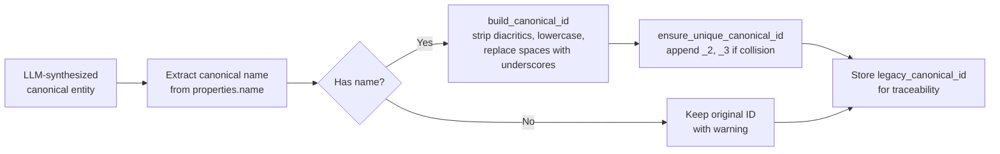

**`build_canonical_id()` rules:**
- Strip Vietnamese diacritics (e.g., "Đại học" → "dai_hoc")
- Lowercase
- Replace spaces with underscores
- Remove unsafe characters (only `[a-z0-9_]` allowed, plus Vietnamese chars which get stripped by diacritic removal)
- Truncate to 200 characters
- Prefix with `node_`

It also preserves `legacy_canonical_id` for traceability.

Relevant files:
- `services/entity_resolution/pipelines/stage3_pipeline.py:248`
- `services/entity_resolution/utils/id_builder.py`

### Graph rewiring behavior

`merging/rewire.py` rewrites nodes and relationships using the canonical map.

It also:

- deduplicates nodes (same canonical ID across files → one node)
- removes self-loops (start == end after canonicalization) and dangling relationships (endpoints not in node set)
- merges duplicate relationships with identical `(source, target, type)`
- merges relationship properties conservatively (scalars: keep first non-null; lists: union and deduplicate)
- adds `merged_from_ids` and `merge_count` metadata to deduplicated relationships
- writes per-file before/after counts for audit

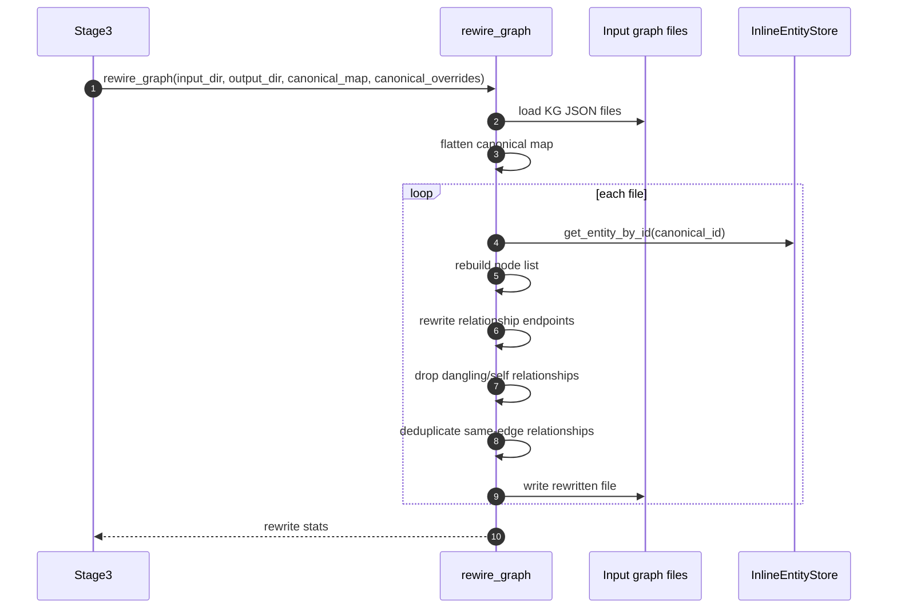

### Relationship deduplication in detail

One of the most important (and non-obvious) rewiring operations:

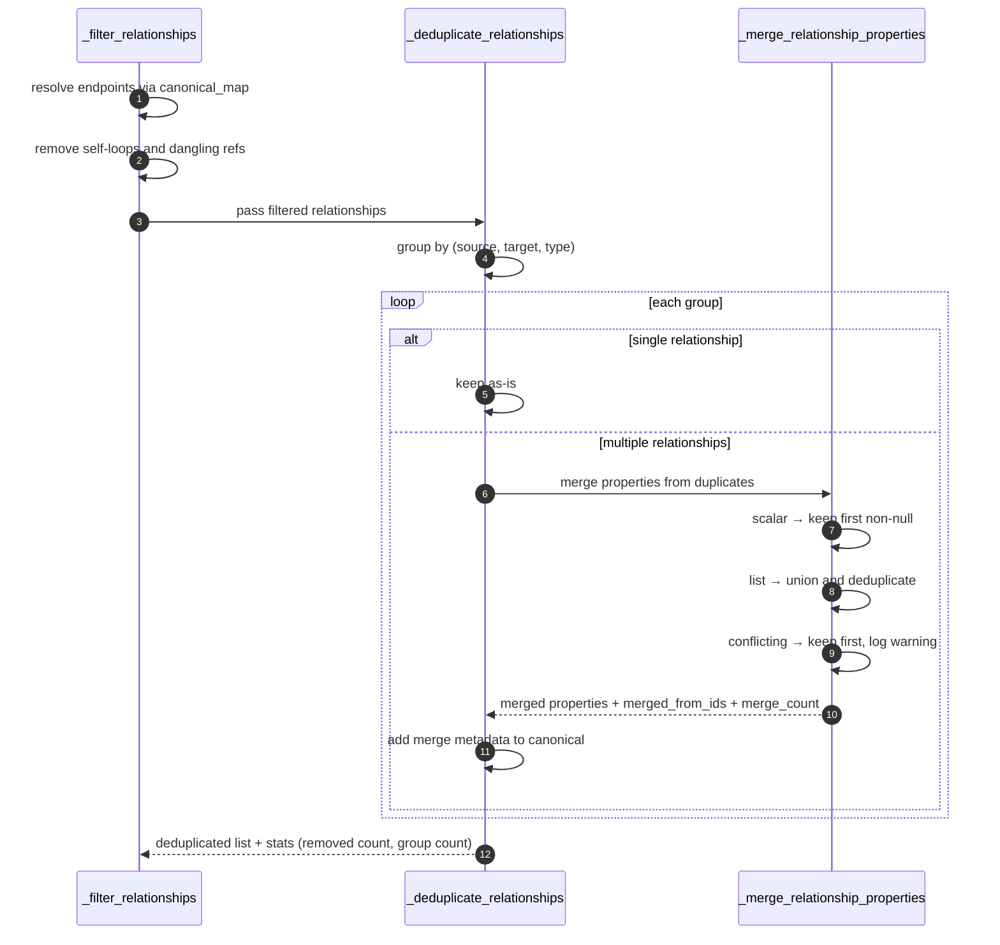

**Property merging strategy:**
- **Scalar values**: first non-null wins; conflicting values keep first and log warning
- **List values**: concatenate and deduplicate (via `set`)
- **Merge metadata**: `merged_from_ids` (list of all original relationship IDs) and `merge_count` (total count in group) are added to the kept relationship

For example, if extraction produces 47 duplicate `HAS_MEMBER` relationships between the same two nodes, they become one relationship with `merge_count: 47`.

Relevant file:
- `services/entity_resolution/merging/rewire.py:66`

## Configuration

`RunConfig` in `config.py` centralizes stage settings.

### Core fields

- `input_dir`
- `artifacts_dir`
- `run_id`
- `collection_name`

### Embedding

- `embedding_model`
- `embedding_dim`

### Clustering

- `min_cluster_size`
- `min_samples`
- `cluster_similarity_threshold`
- `enable_llm_blocking`

### Storage

- `store_backend`
- `qdrant_url`

### LLM

- `llm_provider`
- `llm_model`
- `llm_api_key`
- `llm_temperature`
- `llm_max_tokens`

### Conservative fallback

- `conservative_merge_threshold`
- `enable_conservative_fallback`

Relevant file:
- `services/entity_resolution/config.py:14`

## CLI reference

Common commands:

```bash
# Full run with persistent Qdrant backend
python -m services.entity_resolution.cli \
  --stage all \
  --input-dir data/extracted \
  --artifacts-dir data/entity_resolution/artifacts \
  --store-backend qdrant \
  --run-id my_run

# Full run with ephemeral memory backend
python -m services.entity_resolution.cli \
  --stage all \
  --input-dir data/extracted \
  --store-backend memory \
  --run-id demo_run

# Stage-by-stage with persistent backend
python -m services.entity_resolution.cli --stage stage1 --input-dir data/extracted --store-backend qdrant --run-id my_run
python -m services.entity_resolution.cli --stage stage2 --store-backend qdrant --run-id my_run
python -m services.entity_resolution.cli --stage stage3 --store-backend qdrant --run-id my_run
```

Important flags:

```bash
--stage stage1|stage2|stage3|all
--store-backend qdrant|memory
--qdrant-url http://localhost:6333
--cluster-threshold 0.72
--min-cluster-size 2
--min-samples 1
--enable-llm-blocking
--no-llm-blocking
--llm-provider OpenAICompatible
--llm-model cx/gpt-5.3-codex
```

Relevant file:
- `services/entity_resolution/cli.py:12`

## Artifacts produced by stage

```text
artifacts/<run_id>/
  stage1/
    index.json
    stage1.log
  stage2/
    cluster_assignments.json
    cluster_assignments_enriched.json
    cluster_metrics.json
    cluster_dashboard.html
    stage2.log
  stage3/
    canonical_decisions.json
    id_remap.json
    rewire_audit.json
    synthesis_decisions.json
    output_graph/*.json
    stage3.log
```

## Integration with downstream services

### Neo4j import

After entity resolution completes, the rewritten graph files are imported into Neo4j:

```bash
python -m services.neo4j_import.import_to_neo4j --dir data/entity_resolution/artifacts/<run_id>/stage3/output_graph
```

The Neo4j import script also performs its own relationship deduplication at import time, complementing the pre-import deduplication done in `rewire.py`.

### RAG System

The resolved entities in Neo4j are queried by `services/rag_system` for graph_search and hybrid retrieval modes.

## Testing surface

The current tests focus on regression-heavy behavior around Stage 3, canonicalization, and graph rewiring.

Examples:

- `services/entity_resolution/tests/test_stage3_under_merge.py` checks that Stage 3 produces valid merge artifacts and writes canonical decisions with regenerated IDs.
- `services/entity_resolution/tests/test_two_pass_llm_detailed.py` exercises two-pass resolution behavior including Pass 1 sub-clustering with hard negatives, Pass 2 merging with label mismatches, same-name-different-entity disambiguation, and description-driven separation.
- `services/entity_resolution/tests/test_two_pass_llm_uet_entities.py` tests UET-specific entity cases (service entity separation, organizational unit separation, name variant merging).
- `services/entity_resolution/tests/test_relationship_deduplication.py` covers duplicate-edge handling, property merging strategies, and full `rewire_graph` end-to-end.
- `services/entity_resolution/tests/test_id_builder.py` covers canonical ID generation rules (diacritics, special characters, long names, uniqueness).
- `services/entity_resolution/tests/test_canonical_name_selector.py` tests name selection with Vietnamese/English variants, person names, abbreviations.
- `services/entity_resolution/tests/test_merge_engine.py` tests `build_id_remap_from_proposals` — singleton warnings, correct remapping.
- `services/entity_resolution/tests/test_preprocessing_normalize.py` tests that `build_embedding_text` uses name only and strips PERSON titles.
- `services/entity_resolution/tests/test_e2e_mock_data.py` runs full pipeline on mock data, verifies structure.

## Troubleshooting

### Stage 2 cannot find vectors

If you run stages separately with `--store-backend memory`, Stage 2 will not see Stage 1 vectors from a previous process. Use:

- `--stage all` with `memory`, or
- `qdrant` for multi-command staged runs

Relevant file:
- `services/entity_resolution/storage/entity_store_adapter.py:17`

### Stage 3 appears to under-merge

Check:

- `cluster_assignments.json` from Stage 2 — are the clusters large enough?
- whether Pass 1 is returning all singletons (all-singletons triggers conservative fallback)
- whether subgroup validation triggers conservative fallback (intra-group cosine < 0.83)
- whether `canonical_decisions.json` contains mostly `merge_count: 1`
- whether `conservative_merge_threshold` is too high (default 0.88)

Relevant files:
- `services/entity_resolution/matching/two_pass_llm.py:83`
- `services/entity_resolution/tests/test_stage3_under_merge.py:17`

### Canonical IDs do not match original LLM output

This is expected. Stage 3 regenerates canonical IDs from canonical names after LLM synthesis, then stores the original ID as `legacy_canonical_id`.

Relevant file:
- `services/entity_resolution/pipelines/stage3_pipeline.py:248`

### Relationships disappear after rewiring

This usually means they became:

- self-loops after canonicalization
- dangling references to removed nodes
- duplicates that were intentionally merged away

Check `rewire_audit.json` and the per-file stats returned by `rewire_graph(...)`.

Relevant file:
- `services/entity_resolution/merging/rewire.py:227`

### LLM blocking produces unexpected blocks

Check the Stage 2 log file at `stage2/stage2.log`. It logs:
- Input: all unique label combinations sent to LLM
- Output: all blocks with types and reasoning
- Whether cache was used or a fresh LLM call was made

If the LLM returns unparseable JSON, the fallback creates per-label-combination blocks (each unique label set gets its own block).

Relevant file:
- `services/entity_resolution/blocking/llm_blocking_strategy.py:132`

## Source map

Primary files to read first:

- `services/entity_resolution/cli.py`
- `services/entity_resolution/config.py`
- `services/entity_resolution/pipelines/stage1_pipeline.py`
- `services/entity_resolution/pipelines/stage2_pipeline.py`
- `services/entity_resolution/pipelines/stage3_pipeline.py`
- `services/entity_resolution/matching/two_pass_llm.py`
- `services/entity_resolution/merging/rewire.py`
- `services/entity_resolution/storage/entity_store_adapter.py`
- `services/entity_resolution/blocking/llm_blocking_strategy.py`
- `services/entity_resolution/preprocessing/normalize.py`
- `services/entity_resolution/preprocessing/representation.py`
- `services/entity_resolution/utils/id_builder.py`
- `services/entity_resolution/utils/canonical_name_selector.py`
