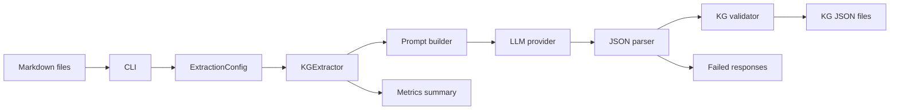
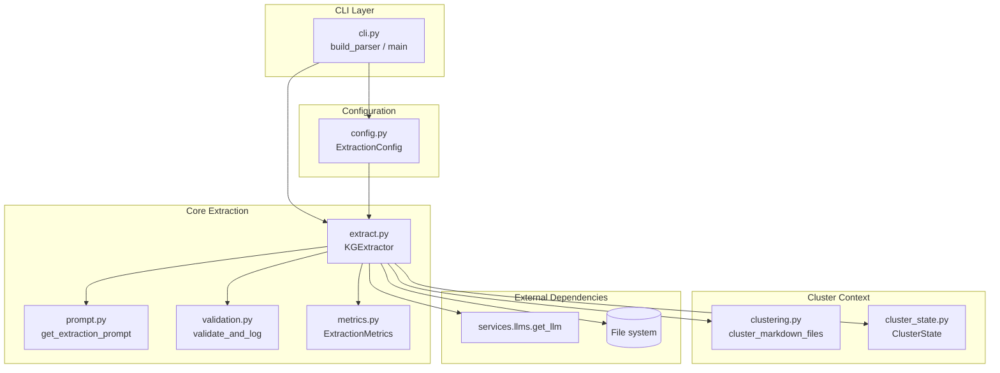
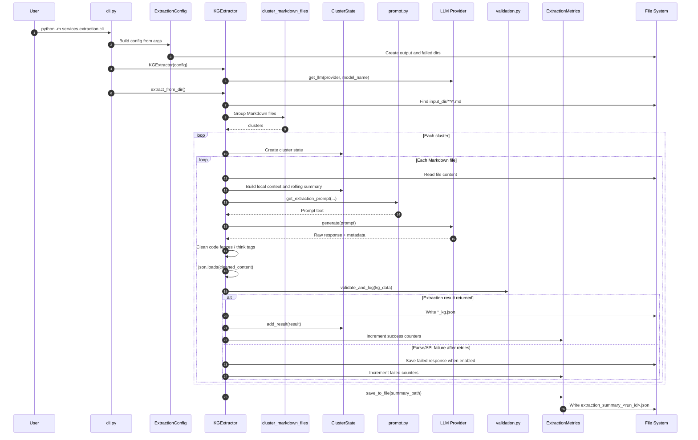
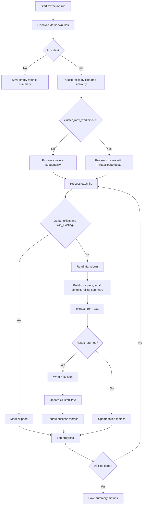
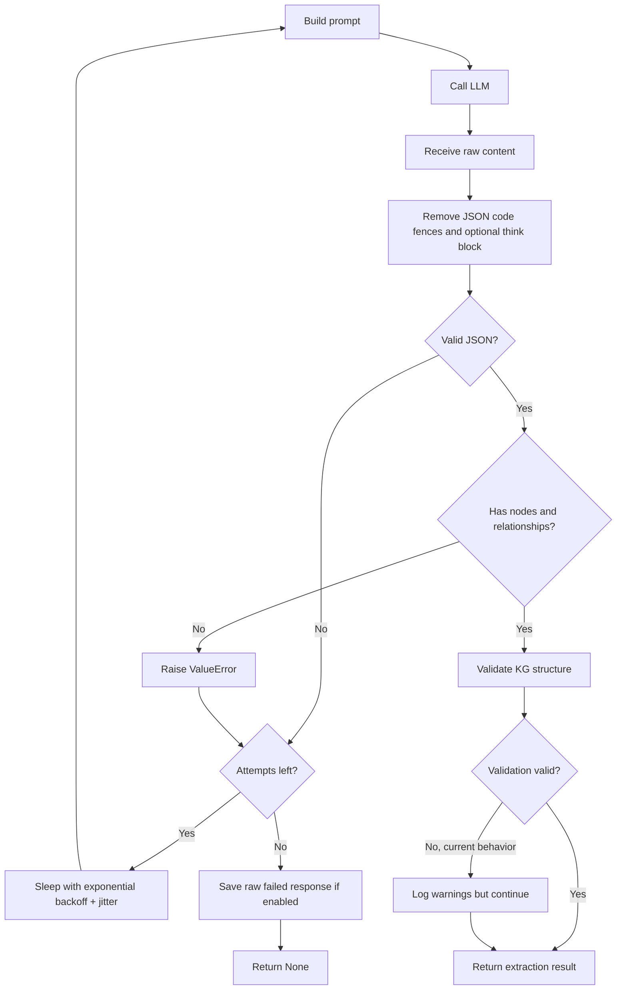
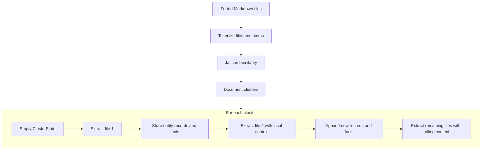
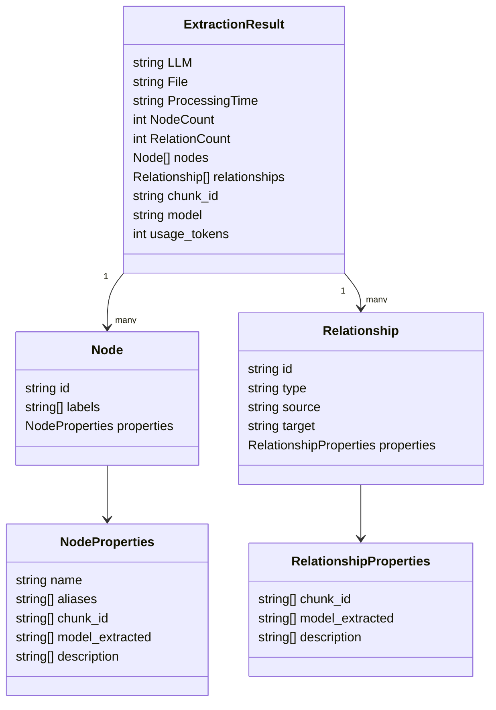
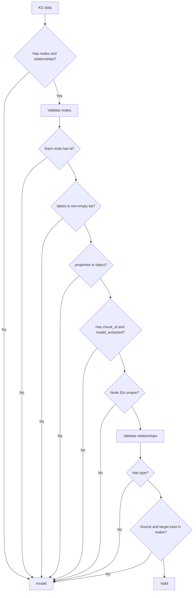
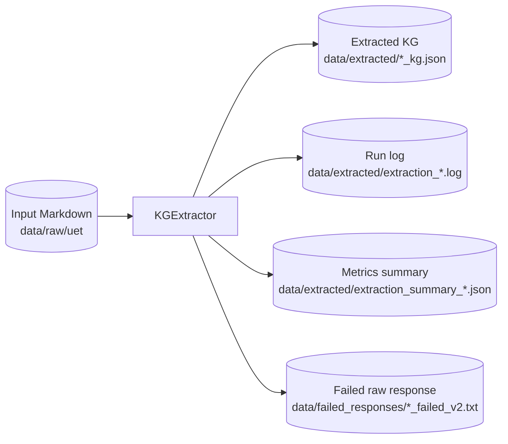
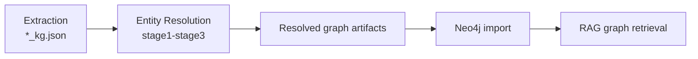

# Extraction Service Architecture

## Overview

`services/extraction` turns Markdown documents into Knowledge Graph JSON using an LLM. It exists to create a structured intermediate representation (`nodes` and `relationships`) that can be validated, resolved, imported into Neo4j, and used by downstream RAG systems.

The service is intentionally file-oriented: each Markdown file is treated as one extraction chunk, and each successful chunk produces one `*_kg.json` artifact.



## Key Concepts

### Chunk

A chunk is the extraction unit passed to the LLM. In the current implementation, one Markdown file maps to one chunk, and the chunk ID is the file stem.

### Cluster

A cluster is a group of Markdown files whose filenames share similar tokens. Files in the same cluster are processed sequentially so later files can use context collected from earlier files.

### Core Pack

The core pack is a small global instruction block that encourages stable canonical names, concise aliases, and consistent naming across related UET/ĐHQGHN files.

### Local Context

Local context is a short list of entities previously extracted inside the same cluster. It helps the LLM reuse canonical names and aliases.

### Rolling Summary

The rolling summary is a compact list of recent facts from previous successful extractions in the same cluster.

## Module Architecture



| Module | Responsibility |
|---|---|
| `cli.py` | Parses command-line options, validates the input directory, builds `ExtractionConfig`, and starts extraction. |
| `config.py` | Stores runtime configuration, converts string paths to `Path`, creates output directories, and generates run-specific paths. |
| `extract.py` | Main orchestrator. Reads files, builds context, calls the LLM, parses JSON, validates results, writes outputs, and records metrics. |
| `prompt.py` | Defines entity labels, output JSON schema, extraction rules, and context section assembly. |
| `validation.py` | Performs structural validation for nodes and relationships and logs warnings. |
| `metrics.py` | Tracks file counts, entity counts, token usage, processing time, and summary output. |
| `clustering.py` | Groups files by Jaccard similarity over sanitized filename tokens. |
| `cluster_state.py` | Stores extracted entity records and facts for cluster-local context. |

## Runtime Sequence



## Processing Flow



## LLM Extraction and Retry Behavior

`KGExtractor.extract_from_text()` is responsible for the LLM call and parse loop. It retries parse/API failures up to `max_retries`.



Important behavior:

- JSON parse failures are retried.
- On the final JSON parse failure, the raw response is saved to `failed_dir` when `save_failed=True`.
- Generic exceptions are retried and eventually return `None`.
- Validation is currently warning-based; invalid structures are logged but still returned as successful extraction results.

## Cluster Context Flow

Clusters allow files with related names to share lightweight context. The first successful file in a cluster populates `ClusterState`; later files receive selected entity records and recent facts in their prompt.



Context sections are capped by `context_char_budget`. When the budget is positive, it is split roughly equally across:

1. core pack,
2. local context,
3. rolling summary.

## Output Data Model

The LLM is instructed to return JSON with two top-level arrays: `nodes` and `relationships`.



Example output shape:

```json
{
  "LLM": "cx/gpt-5.3-codex",
  "File": "data/raw/uet/example.md",
  "Processing Time": "0:00:12.345678",
  "Node count": 2,
  "Relation count": 1,
  "nodes": [
    {
      "id": "node_university_of_engineering_and_technology",
      "labels": ["UNIVERSITY"],
      "properties": {
        "name": "University of Engineering and Technology",
        "aliases": ["UET"],
        "chunk_id": ["example"],
        "model_extracted": ["cx/gpt-5.3-codex"],
        "description": ["A university-level entity grounded in the source document."]
      }
    }
  ],
  "relationships": [
    {
      "id": "rel_node_university_of_engineering_and_technology_node_vnu_MEMBER_OF",
      "type": "MEMBER_OF",
      "source": "node_university_of_engineering_and_technology",
      "target": "node_vnu",
      "properties": {
        "chunk_id": ["example"],
        "model_extracted": ["cx/gpt-5.3-codex"],
        "description": ["The source text states that UET is a member university of VNU."]
      }
    }
  ],
  "chunk_id": "example",
  "model": "cx/gpt-5.3-codex",
  "usage_tokens": 1234
}
```

> Note: The prompt currently shows list-valued properties for `chunk_id`, `model_extracted`, and `description`, while some natural-language rules say these fields must equal a single value. If downstream consumers require strict typing, align the prompt, validator, and importer expectations before changing the schema.

## Validation Rules

`validation.py` performs structural checks and returns `(is_valid, errors)`.



Current validation is soft:

- invalid outputs produce warnings,
- invalid outputs are still saved as successful extraction results,
- strict rejection would require an additional config or code change.

## Configuration Reference

| CLI flag | Config field | Default | Description |
|---|---|---:|---|
| `--input-dir` | `input_dir` | `data/raw/uet` | Markdown input directory. |
| `--output-dir` | `output_dir` | `data/extracted` | Output directory for KG JSON, logs, and summaries. |
| `--provider` | `provider` | `OpenAICompatible` | LLM provider key passed to `get_llm`. |
| `--model` | `model_name` | `cx/gpt-5.3-codex` | LLM model name. |
| `--max-retries` | `max_retries` | `3` | Retry attempts for each extraction. |
| `--save-failed` / `--no-save-failed` | `save_failed` | `True` | Whether to persist failed raw responses. |
| `--skip-existing` / `--no-skip-existing` | `skip_existing` | `True` | Whether existing `*_kg.json` files are skipped. |
| `--cluster-max-workers` | `cluster_max_workers` | `1` | Number of clusters processed concurrently. |
| `--cluster-similarity-threshold` | `cluster_similarity_threshold` | `0.3` | Jaccard threshold for filename-token clustering. |
| `--failed-dir` | `failed_dir` | `data/failed_responses` | Directory for raw failed responses. |

Additional config fields not currently exposed as CLI flags:

| Config field | Default | Purpose |
|---|---:|---|
| `context_char_budget` | `4000` | Maximum combined context characters before per-section capping. |
| `core_pack_enabled` | `True` | Include global naming guidance. |
| `local_context_enabled` | `True` | Include sampled entity records from the current cluster. |
| `rolling_summary_enabled` | `True` | Include recent facts from the current cluster. |
| `local_context_top_k` | `5` | Number of entity records used for local context. |
| `rolling_summary_max_items` | `20` | Maximum recent facts included in the rolling summary. |
| `random_seed` | `42` | Seed for context shuffling. |
| `progress_log_every` | `10` | Log progress every N processed files. |

## Generated Artifacts



| Artifact | Created by | Purpose |
|---|---|---|
| `*_kg.json` | `KGExtractor._process_cluster` | Successful extraction output for one Markdown file. |
| `extraction_<run_id>.log` | `setup_logger` | Console/file log for one extraction run. |
| `extraction_summary_<run_id>.json` | `ExtractionMetrics.save_to_file` | Batch-level counters and averages. |
| `*_failed_v2.txt` | `extract_from_text` | Raw final invalid response after JSON parse retries. |

## Operational Examples

### Normal run

```bash
python -m services.extraction.cli \
  --input-dir data/raw/uet \
  --output-dir data/extracted \
  --provider OpenAICompatible \
  --model cx/gpt-5.3-codex
```

### Re-extract all files

```bash
python -m services.extraction.cli \
  --input-dir data/raw/uet \
  --output-dir data/extracted \
  --no-skip-existing
```

### Debug failed responses

```bash
python -m services.extraction.cli \
  --save-failed \
  --failed-dir data/failed_responses
```

### Process clusters in parallel

```bash
python -m services.extraction.cli \
  --cluster-max-workers 4
```

Use parallel workers carefully. The extractor shares one LLM client instance across worker threads; verify the selected provider/client supports concurrent requests or keep the default `--cluster-max-workers 1`.

## Troubleshooting

| Symptom | Likely cause | Action |
|---|---|---|
| `Input directory does not exist` | Wrong `--input-dir` path. | Check the path relative to the repository root. |
| All files are skipped | Matching `*_kg.json` outputs already exist. | Use `--no-skip-existing` to force re-extraction. |
| JSON parse warnings | LLM returned prose, Markdown, partial JSON, or malformed JSON. | Inspect `data/failed_responses/*_failed_v2.txt`; tighten prompt/model settings if needed. |
| Empty graph warning | Source text has few extractable entities or prompt rules filtered generic mentions. | Inspect the Markdown file and the extraction prompt assumptions. |
| Orphan relationship warning | LLM referenced a node ID that is not present in `nodes`. | Re-run the file or add strict validation before downstream import. |
| Token metrics are zero | Provider response does not include token usage. | Check the selected LLM client implementation. |
| Parallel run is unstable | LLM client or provider rate limits are not concurrency-safe. | Reduce `--cluster-max-workers` to `1`. |

## Known Limitations

1. Validation is warning-based and does not currently block saving invalid graph structures.
2. Filename clustering uses ASCII-oriented tokenization and may be weak for Vietnamese filenames with diacritics.
3. The LLM output contract is prompt-based rather than enforced by a strict Pydantic model.
4. Parallel cluster processing shares one LLM client instance across threads.
5. Some config fields are not exposed through CLI flags.
6. There are currently no dedicated tests under `services/extraction/tests/`.

## Downstream Flow

After extraction, generated `*_kg.json` files are usually passed to entity resolution and then imported into Neo4j.



Typical next command:

```bash
python -m services.entity_resolution.cli \
  --stage all \
  --input-dir data/extracted \
  --store-backend memory \
  --run-id demo_run
```
