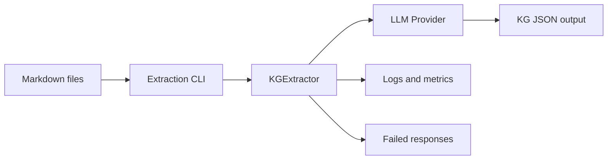

# Knowledge Graph Extraction Service

## Overview

`services/extraction` extracts structured Knowledge Graph data from Markdown documents with an LLM. It is the first stage that converts raw documents into JSON artifacts containing `nodes` and `relationships` for downstream entity resolution, Neo4j import, and RAG workflows.

For the full architecture, runtime sequence, Mermaid diagrams, output schema, and troubleshooting guide, see [`ARCHITECTURE.md`](./ARCHITECTURE.md).



## What It Does

- Reads Markdown files from an input directory.
- Groups related files into filename-based clusters.
- Builds an extraction prompt with optional cluster-local context.
- Calls an LLM provider through `services.llms.get_llm`.
- Parses the LLM response as JSON.
- Validates the extracted Knowledge Graph structure.
- Writes one `*_kg.json` output per Markdown file.
- Records logs, failed raw responses, and batch summary metrics.

## Project Structure

```text
services/extraction/
├── README.md          # Quick start and entrypoint documentation
├── ARCHITECTURE.md    # Detailed architecture and diagrams
├── cli.py             # CLI entrypoint
├── config.py          # Runtime configuration and output paths
├── extract.py         # Main extraction orchestrator
├── prompt.py          # Prompt template and JSON contract
├── validation.py      # KG output validation helpers
├── metrics.py         # Batch metrics aggregation
├── clustering.py      # Filename-based document clustering
└── cluster_state.py   # Per-cluster context state
```

## Quick Start

Run from the repository root:

```bash
python -m services.extraction.cli \
  --input-dir data/raw/uet \
  --output-dir data/extracted \
  --provider OpenAICompatible \
  --model cx/gpt-5.3-codex
```

Re-extract files even when outputs already exist:

```bash
python -m services.extraction.cli \
  --input-dir data/raw/uet \
  --output-dir data/extracted \
  --no-skip-existing
```

Save failed LLM responses for debugging:

```bash
python -m services.extraction.cli \
  --save-failed \
  --failed-dir data/failed_responses
```

Process multiple clusters concurrently:

```bash
python -m services.extraction.cli \
  --cluster-max-workers 4
```

> Note: Use parallel workers only if the configured LLM provider/client is safe for concurrent requests and your provider rate limits allow it.

## Common CLI Options

| Option | Default | Description |
|---|---:|---|
| `--input-dir` | `data/raw/uet` | Directory containing Markdown input files. |
| `--output-dir` | `data/extracted` | Directory for extracted `*_kg.json`, logs, and summary files. |
| `--provider` | `OpenAICompatible` | LLM provider name. |
| `--model` | `cx/gpt-5.3-codex` | LLM model name. |
| `--max-retries` | `3` | Maximum attempts per file after parse/API failures. |
| `--skip-existing` / `--no-skip-existing` | `True` | Skip or overwrite existing output files. |
| `--save-failed` / `--no-save-failed` | `True` | Save raw failed LLM responses. |
| `--failed-dir` | `data/failed_responses` | Directory for failed response text files. |
| `--cluster-max-workers` | `1` | Number of document clusters to process in parallel. |
| `--cluster-similarity-threshold` | `0.3` | Filename-token Jaccard threshold used for clustering. |

## Generated Artifacts

| Artifact | Default location | Purpose |
|---|---|---|
| Extracted KG JSON | `data/extracted/*_kg.json` | Per-file Knowledge Graph output. |
| Run log | `data/extracted/extraction_<run_id>.log` | Runtime events and warnings. |
| Metrics summary | `data/extracted/extraction_summary_<run_id>.json` | Batch counters and averages. |
| Failed response | `data/failed_responses/*_failed_v2.txt` | Raw invalid LLM response for debugging. |

## Next Steps

After extraction, the generated KG JSON files are typically consumed by the entity-resolution pipeline:

```bash
python -m services.entity_resolution.cli \
  --stage all \
  --input-dir data/extracted \
  --store-backend memory \
  --run-id demo_run
```

Then import the resolved graph into Neo4j with the backend import scripts documented in the repository root guidelines.
