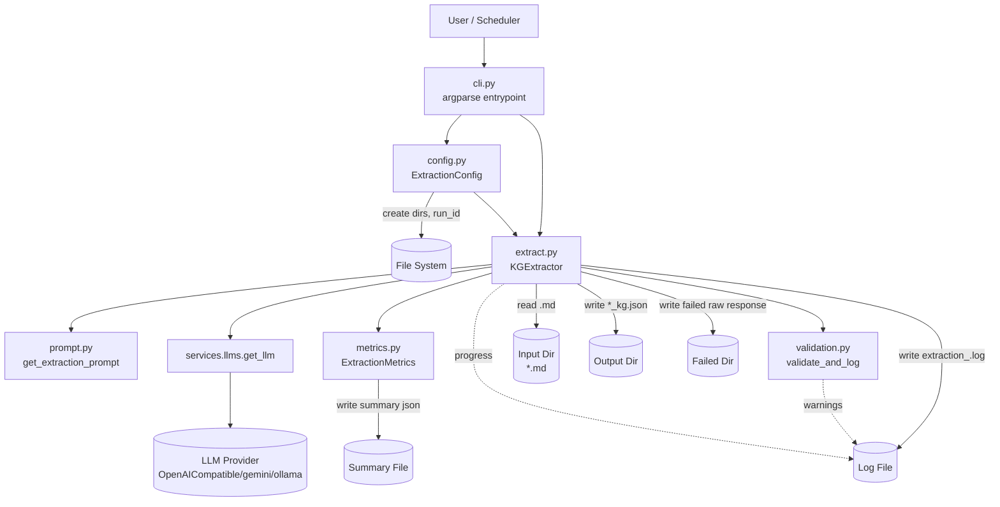
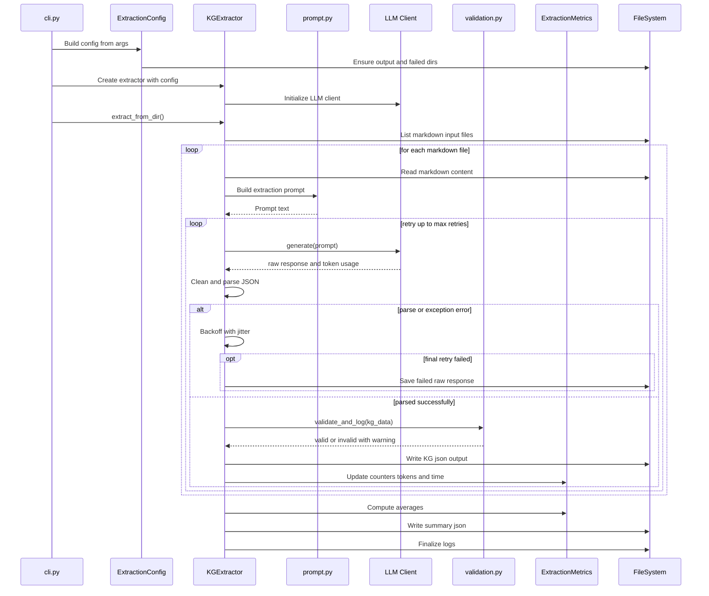

# Knowledge Graph Extraction Service

## Overview
`services/extraction` là pipeline trích xuất tri thức từ tài liệu Markdown để tạo ra dữ liệu Knowledge Graph chuẩn JSON (`nodes`, `relationships`) bằng LLM.
Module này hỗ trợ chạy batch, retry khi lỗi, validation cấu trúc output, logging và metrics tổng hợp theo từng run.

## Quick Start

```bash
# Từ root project
python -m services.extraction.cli \
  --input-dir data/raw/uet \
  --output-dir data/extracted \
  --provider OpenAICompatible \
  --model cx/gpt-5.3-codex
```

Ví dụ chạy lại toàn bộ file (không skip file đã có output):

```bash
python -m services.extraction.cli --no-skip-existing
```

Các tham số hữu ích:
- `--max-retries`: số lần retry khi lỗi LLM/parse JSON
- `--save-failed` / `--no-save-failed`: lưu raw response lỗi để debug
- `--failed-dir`: thư mục chứa failed responses

## Architecture (detailed architecture diagram)
Kiến trúc extraction gồm 6 lớp chính:
1. **CLI Layer (`cli.py`)**: nhận args, validate input, khởi chạy pipeline.
2. **Config Layer (`config.py`)**: quản lý cấu hình runtime và đường dẫn output/log/summary.
3. **Core Orchestration (`extract.py`)**: điều phối đọc file, gọi LLM, parse, validate, save output.
4. **Prompt Contract (`prompt.py`)**: định nghĩa schema JSON + extraction rules cho LLM.
5. **Validation (`validation.py`)**: kiểm tra cấu trúc KG output (soft validation, warning-based).
6. **Metrics & Observability (`metrics.py`)**: thu thập thống kê batch và ghi summary JSON.

### Component Diagram



### Runtime Sequence Diagram



## Project Structure
```text
services/extraction/
├── cli.py          # CLI entrypoint, parse args, start pipeline
├── config.py       # ExtractionConfig: runtime config + output/log paths
├── extract.py      # KGExtractor: core orchestration and batch processing
├── prompt.py       # Prompt template + JSON schema contract for LLM
├── validation.py   # Output structure validation (nodes/relationships)
├── metrics.py      # Batch metrics aggregation and summary export
└── tests/          # Unit/integration tests for extraction module
```