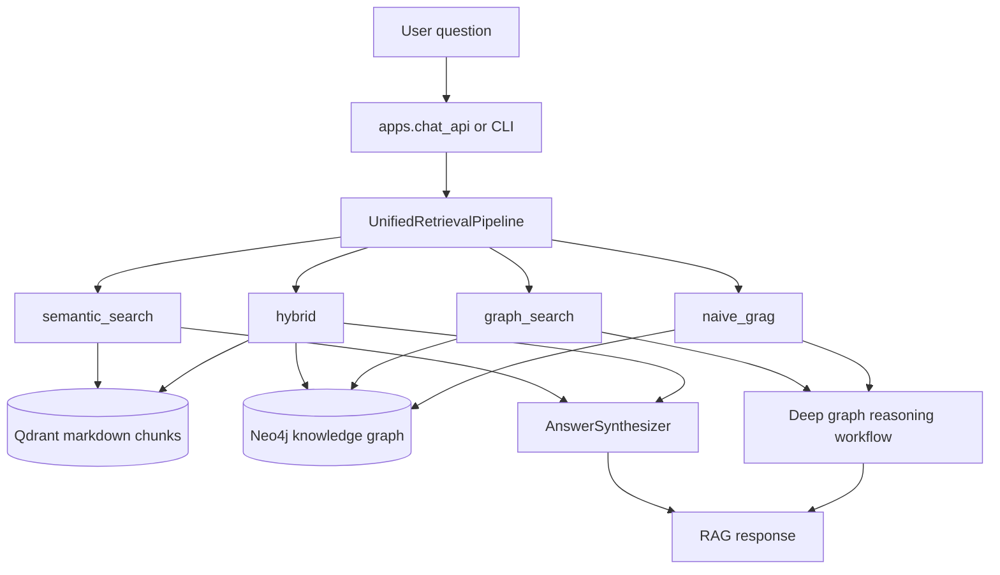
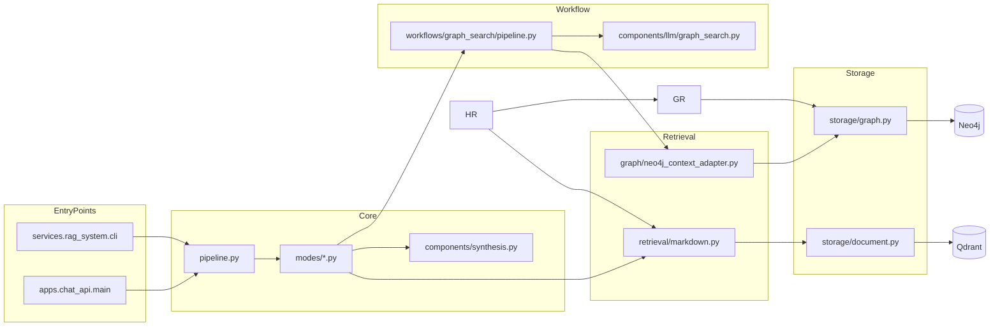
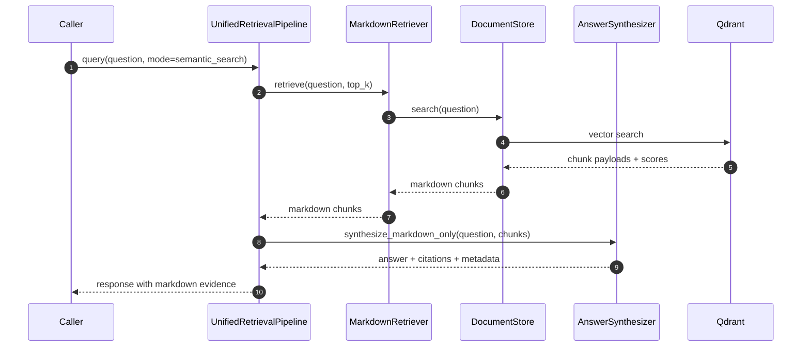
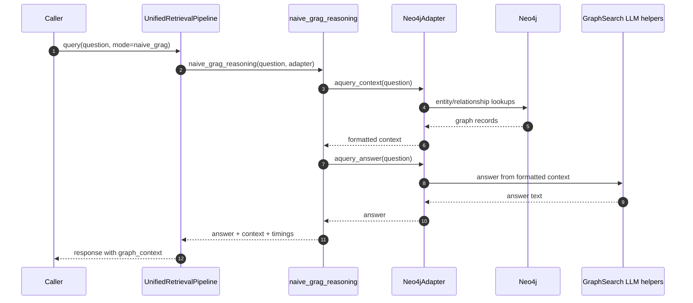
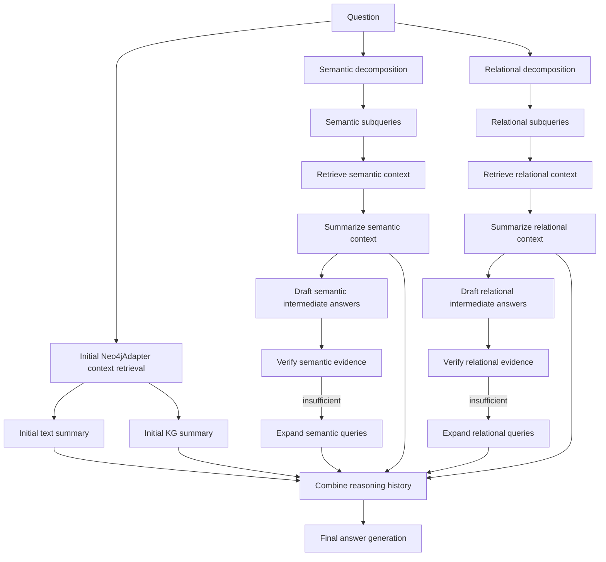
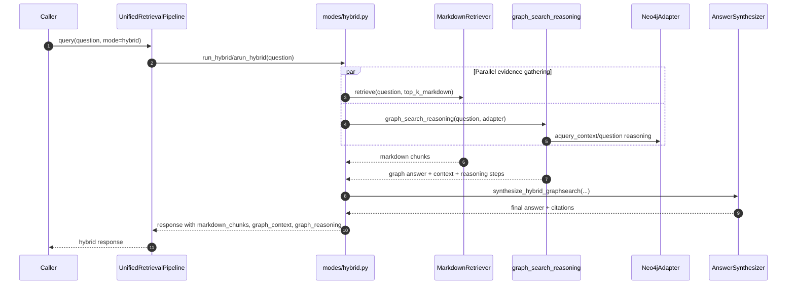
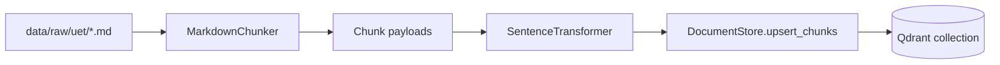
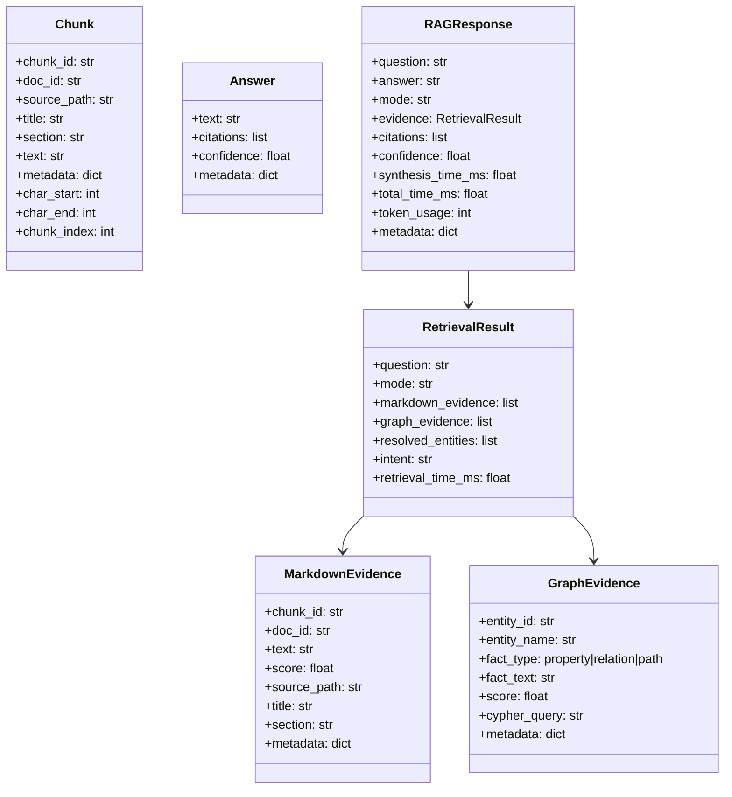

# Unified RAG System

## Overview

`services/rag_system` is the runtime retrieval layer behind `apps/chat_api` and the RAG CLI. It provides one query surface over two evidence stores:

- markdown chunks stored in Qdrant
- entity and relationship data stored in Neo4j

The package exists to let the application answer the same user question through different retrieval strategies without changing the caller. The main entrypoint is `services/rag_system/pipeline.py`, which dispatches to user-facing mode implementations in `services/rag_system/modes/`.



## Public modes

`services/rag_system/pipeline.py` supports exactly four public modes:

- `semantic_search`: retrieve markdown chunks from Qdrant, then synthesize one answer from text evidence only.
- `graph_search`: run a multi-step Neo4j-only reasoning workflow with decomposition, verification, and optional query expansion.
- `naive_grag`: run a simpler Neo4j-only path that fetches graph context once and answers from it directly.
- `hybrid`: retrieve markdown chunks and run deep `graph_search` in parallel, then synthesize one answer from semantic and GraphSearch evidence.

## Package structure

```text
services/rag_system/
  cli.py                         # operational CLI
  config.py                      # RAGConfig
  schemas.py                     # Chunk/evidence/response schemas
  README.md
  pipeline.py                    # main orchestration entrypoint
  modes/
    semantic_search.py           # Qdrant markdown mode
    hybrid.py                    # semantic markdown + graph_search mode
    graph_search.py              # multi-step graph reasoning mode
    graph_context.py             # one-pass graph context mode for naive_grag
    common.py                    # shared response/evidence helpers
  components/
    synthesis.py                 # LLM answer synthesis for semantic/hybrid
    llm/graph_search.py          # async GraphSearch helper calls
    prompts/prompts.py           # GraphSearch prompts
  retrieval/
    markdown.py                  # Qdrant markdown retrieval
    indexing.py                  # markdown indexing into Qdrant
    chunking.py                  # markdown chunking strategies
  graph/
    neo4j_context_adapter.py     # Neo4j -> GraphSearch context adapter
  storage/
    document.py                  # Qdrant client + embedding upsert/search
    graph.py                     # Neo4j lookup helpers
  workflows/
    graph_search/
      pipeline.py                # graph_search and naive_grag workflows
      parsing.py                 # decomposition/expansion parsing helpers
      utils.py                   # normalization and formatting helpers
  evaluation/
    runner.py                    # simple JSONL/CSV evaluation runner
    mock_questions.jsonl         # small mock question set
  tests/
    test_unified_pipeline.py
    test_graph_search_neo4j_adapter.py
    ...
```

## Key concepts

### 1. Two retrieval families

There are two separate retrieval backends:

- **Document retrieval** via `storage/document.py` and `retrieval/markdown.py`
- **Graph retrieval** via `storage/graph.py` and `graph/neo4j_context_adapter.py`

### 2. Two graph-only modes

The codebase intentionally keeps two Neo4j-only paths:

- **`naive_grag`** for one-pass context retrieval plus answer generation
- **`graph_search`** for deeper iterative reasoning when the question benefits from decomposition or evidence verification

### 3. Two answer-generation styles

- `semantic_search` uses `components/synthesis.py` over markdown evidence only.
- `hybrid` uses `components/synthesis.py` over markdown evidence plus deep GraphSearch context/reasoning.
- `graph_search` and `naive_grag` generate graph-backed answers inside `workflows/graph_search/pipeline.py` through async workflow components.

## Architecture

### Runtime components



### Configuration model

`config.py` defines `RAGConfig`, which centralizes:

- data directories (`markdown_dir`, `output_dir`)
- Qdrant settings (`qdrant_url`, `markdown_collection`)
- Neo4j settings (`neo4j_uri`, `neo4j_user`, `neo4j_password`)
- embedding settings (`embedding_model`, `embedding_dim`, `embedding_batch_size`)
- chunking settings (`chunk_strategy`, `max_chunk_size`, `chunk_overlap`)
- retrieval settings (`top_k_markdown`, `top_k_graph`, `max_graph_depth`, `max_relations`)
- LLM settings (`llm_provider`, `llm_model`, `llm_temperature`, `llm_max_tokens`)
- fusion settings for hybrid ranking (`fusion_strategy`, `graph_weight`, `markdown_weight`)
- keyword-extraction settings for the Neo4j GraphSearch adapter
- evaluation dataset/output paths

## How each mode works

### `semantic_search`

`semantic_search` is the simplest path. It retrieves the top-k markdown chunks from Qdrant and asks the synthesizer to answer using only those chunks.



Relevant files:
- `services/rag_system/modes/semantic_search.py`
- `services/rag_system/pipeline.py`
- `services/rag_system/retrieval/markdown.py`
- `services/rag_system/storage/document.py`
- `services/rag_system/components/synthesis.py`

### `naive_grag`

`naive_grag` uses the GraphSearch adapter but skips the full iterative reasoning chain. It fetches formatted graph/document context once, then generates an answer from that context.



Relevant files:
- `services/rag_system/modes/graph_context.py`
- `services/rag_system/pipeline.py`
- `services/rag_system/workflows/graph_search/pipeline.py`
- `services/rag_system/graph/neo4j_context_adapter.py`

### `graph_search`

`graph_search` is the deepest reasoning path. It starts with initial context retrieval, then builds separate semantic and relational reasoning chains, verifies them, optionally expands queries, and finally produces one final answer.



Relevant files:
- `services/rag_system/modes/graph_search.py`
- `services/rag_system/pipeline.py`
- `services/rag_system/workflows/graph_search/pipeline.py`
- `services/rag_system/workflows/graph_search/parsing.py`
- `services/rag_system/components/llm/graph_search.py`

### `hybrid`

`hybrid` runs markdown retrieval and deep `graph_search` concurrently, then synthesizes one answer from markdown chunks plus GraphSearch context/reasoning.



Relevant files:
- `services/rag_system/modes/hybrid.py`
- `services/rag_system/modes/graph_search.py`
- `services/rag_system/pipeline.py`
- `services/rag_system/graph/neo4j_context_adapter.py`
- `services/rag_system/workflows/graph_search/pipeline.py`
- `services/rag_system/components/synthesis.py`

## Data flow for markdown indexing

The indexing side is separate from query execution. It turns local markdown files into chunk payloads, embeds them with `SentenceTransformer`, and stores them in Qdrant.



Relevant files:
- `services/rag_system/retrieval/indexing.py:11`
- `services/rag_system/retrieval/chunking.py:9`
- `services/rag_system/storage/document.py:11`

## Data model

`schemas.py` contains the core runtime types.



## CLI reference

The main operational commands are defined in `services/rag_system/cli.py`:

```bash
python -m services.rag_system.cli test-connections
python -m services.rag_system.cli create-collection
python -m services.rag_system.cli delete-collection
python -m services.rag_system.cli index --limit 100
python -m services.rag_system.cli query --question "Hiệu trưởng là ai?" --mode semantic_search --top-k 5 --show-evidence
python -m services.rag_system.cli info

python -m services.rag_system.cli evaluate run --dataset <jsonl> --output <jsonl> --mode semantic_search --top-k 5
python -m services.rag_system.cli evaluate run-comparison --dataset <jsonl> --output <jsonl> --mode semantic_search --mode graph_search --top-k 5
python -m services.rag_system.cli evaluate score --results <jsonl> --output <jsonl>
```

## Evaluation workflow

The evaluation pipeline is intentionally split into two stages:

```text
manual testset JSONL -> run RAG modes -> generated JSONL/CSV -> RAGAS scoring -> scored JSONL/CSV + summary
```

Manual testset rows use JSONL. Required fields are `id` and `question`; optional fields are `reference`, `tags`, and `metadata`:

```json
{"id":"mock_001","question":"Hiệu trưởng Trường Đại học Công nghệ là ai?","reference":"Câu trả lời cần nêu đúng người giữ vai trò Hiệu trưởng nếu thông tin có trong dữ liệu.","tags":["single_hop","entity_lookup"],"metadata":{"source":"manual"}}
```

Run one mode and save JSONL plus CSV:

```bash
python -m services.rag_system.cli evaluate run \
  --dataset services/rag_system/evaluation/mock_questions.jsonl \
  --output data/evaluation/semantic_search.jsonl \
  --mode semantic_search \
  --top-k 5
```

Run a comparison across modes. If no `--mode` is provided, all public modes are used:

```bash
python -m services.rag_system.cli evaluate run-comparison \
  --dataset services/rag_system/evaluation/mock_questions.jsonl \
  --output data/evaluation/comparison.jsonl \
  --mode semantic_search \
  --mode graph_search \
  --mode naive_grag \
  --mode hybrid \
  --top-k 5
```

Generated rows include `question`, `answer`, `contexts`, `reference`, `mode`, `latency_ms`, `status`, and `error`, so failed mode/sample runs are saved instead of aborting the whole comparison.

RAGAS is optional and only required for scoring saved outputs. Install it with:

```bash
pip install -r requirements.txt
pip install -e . --no-deps
```

Scoring reads evaluator credentials from `OPENAI_API_KEY`, `OPENAI_BASE_URL`, and `OPENAI_MODEL` first, then falls back to `OPENAI_COMPATIBLE_API_KEY`, `OPENAI_COMPATIBLE_BASE_URL`, and `OPENAI_COMPATIBLE_MODEL`.

Load `.env` before scoring:

```bash
set -a
source .env
set +a
```

Then score generated outputs:

```bash
python -m services.rag_system.cli evaluate score \
  --results data/evaluation/comparison.jsonl \
  --output data/evaluation/comparison.scored.jsonl
```

Scoring writes a scored JSONL, a scored CSV, and a summary CSV grouped by mode. Rows are marked `scored` only when all selected metrics return valid numeric values; failed or missing metric outputs are marked `partial`, `error`, or `skipped`.

## Runtime requirements

### For `semantic_search`
- Qdrant must be reachable.
- The markdown collection must exist.
- Markdown files must already be indexed.

### For `naive_grag` and `graph_search`
- Neo4j must be reachable.
- The imported graph must already exist.

### For `hybrid`
- Both Qdrant markdown indexing and Neo4j graph data must be available.

### For all modes
- LLM access must be configured through `services.llms.get_llm(...)` or the async GraphSearch helpers.

## Testing surface

Current tests cover the main public behavior instead of every implementation detail:

- `services/rag_system/tests/test_unified_pipeline.py` checks mode behavior, evidence normalization, async entrypoints, and hybrid deduplication.
- `services/rag_system/tests/test_graph_search_neo4j_adapter.py` checks GraphSearch context formatting, context splitting, keyword extraction, fallback behavior, and markdown-chunk resolution.
- additional tests cover chunking, indexing, storage, parsing, and evaluation modules.

## Troubleshooting

### No markdown results returned

Check:
- the Qdrant service is running
- the collection exists
- `python -m services.rag_system.cli index` has been run

The markdown retriever explicitly returns an empty list when the collection does not exist.

### Graph modes fail inside an active event loop

`UnifiedRetrievalPipeline.query()` cannot execute async graph workflows when an event loop is already active. In async callers, use `await UnifiedRetrievalPipeline.aquery(...)` instead.

Relevant file:
- `services/rag_system/pipeline.py:71`

### Hybrid mode returns weak fused evidence

Check the fusion settings in `RAGConfig`:
- `fusion_strategy`
- `markdown_weight`
- `graph_weight`

`hybrid` currently supports weighted fusion and reciprocal-rank fusion (`rrf`).

### GraphSearch misses obvious UET entity names

The Neo4j adapter applies domain-specific keyword normalization and boosting for UET/hiệu trưởng queries before retrieval. If results still look wrong, inspect:
- `graph_keyword_extraction_mode`
- `graph_keyword_max_terms`
- `graph_keyword_timeout_seconds`

Relevant file:
- `services/rag_system/graph/neo4j_context_adapter.py:272`

## Source map

Primary files to read first:

- `services/rag_system/pipeline.py`
- `services/rag_system/modes/hybrid.py`
- `services/rag_system/graph/neo4j_context_adapter.py`
- `services/rag_system/workflows/graph_search/pipeline.py`
- `services/rag_system/components/synthesis.py`
- `services/rag_system/cli.py`
